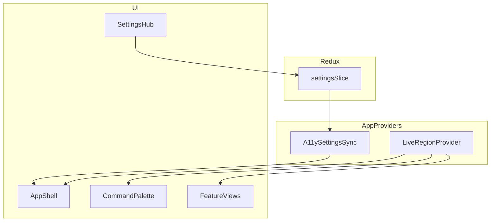

# Accessibility-Audit + Overhaul-Plan (WorldScript-Studio)

## Kurz-Einordnung des Ist-Zustands

- **Shell / Navigation**: Skip-Link und `#main-content` sind vorhanden ([`App.tsx`](App.tsx) Zeilen 338–371). Eine `aria-live`-Region kündigt View-Wechsel an, verliest aber aktuell den **rohen View-Key** (`dashboard`, `writer`, …) statt des **übersetzten Seitentitels** — für WCAG 3.3.x / 4.1.x (vorhersehbare, verständliche Statusmeldungen) ist das eine konkrete Lücke.
- **Sprache**: [`I18nContext.tsx`](contexts/I18nContext.tsx) setzt `document.documentElement.lang` — gut. **`dir`/RTL** und locale-aware Zahlen/Datum sind noch nicht systematisch angelegt (nur L10n-Vorbereitung).
- **Einstellungen Barrierefreiheit**: Redux-Typ [`AccessibilitySettings`](types.ts) + UI in [`SystemSections.tsx`](components/settings/SystemSections.tsx): High Contrast, Reduced Motion, Large Text, Screen Reader, Focus Indicators, Farbblind-Modus. Body-Klassen für Kontrast/Motion in [`App.tsx`](App.tsx). **Zu prüfen in Umsetzungsphase**: ob `largeText`, `screenReader`, `focusIndicators`, `colorBlindMode` überall konsistent in [`index.css`](index.css) / Tokens wirken und mit System-`prefers-reduced-motion`/`prefers-contrast` sinnvoll kombiniert werden (keine Doppelkonflikte).
- **Modale**: [`Modal.tsx`](components/ui/Modal.tsx) — Fokus-Falle, ESC, Fokus-Rückgabe; strukturell ist das **äußere** `role="dialog"`-Element der Vollfläche — für Screenreader ist eine **klare Trennung** „Backdrop vs. Dialog-Panel“ (Backdrop ohne Dialog-Rolle, Panel als Dialog) oft robuster (Audit-Hinweis).
- **Command Palette**: [`CommandPalette.tsx`](components/CommandPalette.tsx) — `role="dialog"`, `aria-modal`, Combobox-Input mit `aria-activedescendant`, `role="listbox"`/`option` — solide Basis. **Lücken**: kein vollständiger **Tab-Fokus-Fang** innerhalb der Palette (nur Pfeiltasten); keine **`aria-live`** für Suchergebnis-Anzahl / „Keine Treffer“; Gruppen-Überschriften sind visuelle `div`s ohne **`role="group"`** + referenzierte Labels (APG Listbox mit gruppierten Optionen).
- **CI / Lighthouse**: [`.lighthouserc.cjs`](.lighthouserc.cjs) enthält **keine** Accessibility-Assertions — das widerspricht der Erwartung „Lighthouse CI mit A11y-Assertions“; Ergänzung ist Teil von Phase 4.
- **`packages/ui`**: enthält praktisch nur [`tokens.ts`](packages/ui/src/tokens.ts) und [`tailwind-preset.ts`](packages/ui/tailwind-preset.ts) — ein „Refactor von packages/ui um A11y-Props“ sollte realistisch als **Erweiterung von [`components/ui/*`](components/ui)** + ggf. **Design-Tokens** gefasst werden, nicht als große externe Component Library.

---

## Schritt 1 — Audit-Raster (Accessibility + Best Practices)

*Format bewusst als Liste (keine Markdown-Tabellen gemäß Plan-Renderer). Pro Bereich: **WCAG 2.2 AA-Fokus** + ausgewählte **Best Practices** (Perf, Security, i18n, Tests).*

### Globales Layout / App-Shell ([`App.tsx`](App.tsx), [`Header.tsx`](components/Header.tsx), [`Sidebar.tsx`](components/Sidebar.tsx))

- **A11y — Ist**: Skip-Link; `<main id="main-content">` mit `aria-label`; Reduced-Motion/High-Contrast-Klassen; Notifications über [`ToastProvider`](components/ui/Toast.tsx) mit `role="status"` + `aria-live="polite"`.
- **Lücken**: Live-Region für View-Wechsel ohne menschenlesbare/i18n-Texte; mögliche **Landmark-Lücken** (fehlendes explizites `<nav>` mit Label für Sidebar/Header-Nav je nach DOM); Mobile Bottom-Bar: prüfen ob **`aria-current`** und Fokusreihenfolge über Drawer hinweg stimmen.
- **Geplant**: Zentrale **`announce()`**-Hilfe (siehe Architektur); übersetzte View-Namen; optionales `<nav aria-label="…">` um Hauptnavigation; Dokumentation der Tab-Reihenfolge bei geöffnetem Sidebar-Overlay.

### Welcome Portal ([`WelcomePortal.tsx`](components/WelcomePortal.tsx))

- **A11y — Ist**: Teilweise `aria-label` (z. B. Sprachwahl).
- **Lücken**: Vollständige Tastatur-/Fokus-Reihenfolge beim ersten Start; Focus-Management beim „Portal verlassen“; Kontrast der Marketing-/Glass-UI in Dark/Light.
- **Geplant**: Beim Schließen Fokus auf sinnvolles erstes Shell-Control; konsistente Überschriften-Hierarchie (`h1`…).

### Command Palette ([`CommandPalette.tsx`](components/CommandPalette.tsx))

- **A11y — Ist**: Keyboard-first (↑↓ Enter Esc); Voice-Input; Combobox/Listbox-Basis; Kurzbuchstaben in Fußzeile.
- **Lücken**: Tab-Fokus-Falle; Live-Updates für Ergebnisliste; APG-konforme **Gruppierung**; Return-Focus nach Schließen zum Auslöser; Screenreader-Hinweis auf Voice-Modus-Status (`aria-pressed` am Mikrofon-Button fehlt).
- **Geplant**: `aria-pressed` für Listening; `aria-live="polite"` für Trefferzahl; Fokus-Trap wie [`Modal.tsx`](components/ui/Modal.tsx) oder gemeinsamer Hook; bei leerer Query optional Rolle **„region“** für Sektionen mit `aria-labelledby`.

### Settings — Accessibility-Bereich ([`SettingsView.tsx`](components/SettingsView.tsx), [`SystemSections.tsx`](components/settings/SystemSections.tsx))

- **A11y — Ist**: Schalter mit Labels; Farbblind-Auswahl als natives `<select>` (mit Label prüfen — [`noLabelWithoutControl`](biome.json) sollte greifen).
- **Lücken**: Kein „Hub“ mit Erklärungen, Presets, Live-Vorschau; keine Kopplung an Help-Artikel „Screenreader“; Settings-Suche ([`settingsSearchHints.ts`](services/settingsSearchHints.ts)) um neue Keys erweitern.
- **Geplant**: Neuer Abschnitt **Accessibility Hub** (Spezifikation unten); Redux-Erweiterung + Migration; Presets als atomare Sets von Flags.

### Help ([`HelpView.tsx`](components/HelpView.tsx), [`services/help/*`](services/help/))

- **A11y — Ist**: Help AI / statische Docs (genauer Stand in Umsetzungsphase verifizieren).
- **Lücken**: Dedizierte Seite/Section „Mit Screenreader nutzen“; Überschriftenstruktur für Dokumentation; Fokus bei internem Tab-Wechsel.
- **Geplant**: Verlinkung aus Settings-Hub; i18n-Keys in allen 5 Sprachen ([`locales/*/`](locales/) + Bundle-Pipeline).

### Dashboard ([`Dashboard.tsx`](components/Dashboard.tsx))

- **A11y — Ist**: cards/links vermutlich gemischt (zu verifizieren).
- **Lücken**: KPI-Kacheln mit klarem Namen; redundanter Linktext; Chart-only Information ohne Textalternative (falls vorhanden).
- **Geplant**: Überschriften pro Widget; „A11y Health Score“ nur wenn messbar (siehe Extras) — sonst CI-Dashboard-Link.

### Manuscript / Writer / Drei-Spalten-Editor ([`ManuscriptView.tsx`](components/ManuscriptView.tsx), [`WriterView.tsx`](components/WriterView.tsx))

- **A11y — Ist**: Editor als Kern — vermutlich viele Custom-Controls.
- **Lücken**: Fokus in verschachtelten Paneelen; ARIA für Splitter; Scroll-Regionen mit `aria-label`; AI-Streaming ohne Live-Region.
- **Geplant**: Splitter als `separator` mit Tastatur (APG); **`aria-busy`** / Live-Region für AI-Ladevorgänge (analog [`AiSections.tsx`](components/settings/AiSections.tsx) `aria-busy` für RAG).

### Scene Board ([`SceneBoardView.tsx`](components/SceneBoardView.tsx))

- **A11y — Ist**: `role="list"`, Tablist für Modi, mehrere `aria-label`s — überdurchschnittlich.
- **Lücken**: Drag&Drop nur mausorientiert — Tastatur-/Screenreader-Alternative (Menü „Nach oben/unten verschieben“); Kanban als **nicht-Grid** aus SR-Sicht ohne strukturierte Alternative.
- **Geplant**: Zusätzliche **„Listen-Ansicht“** oder ARIA-`grid`/`row`/`gridcell` wo sinnvoll; dokumentierte Shortcuts.

### Character Graph ([`CharacterGraphView.tsx`](components/CharacterGraphView.tsx))

- **A11y — Ist**: (Codebasis-Grep) kaum explizite ARIA — hohes Risiko.
- **Lücken**: SVG/Canvas ohne Namen; keine Tastaturnavigation Knoten/Kanten; keine alternative tabellarische Darstellung.
- **Geplant**: **Tabellen-/Listen-Alternative** (Pflicht für AA in komplexen Visualisierungen); SVG `role="img"` + `aria-labelledby` oder Knoten als fokussierbare Elemente mit Beschreibung.

### Consistency Checker / Critic / AI-lastige Views

- **Lücken**: Lange Ergebnislisten ohne Virtualisierung (Perf + SR Überlast); Fehlermeldungen nicht immer mit `aria-live`.
- **Geplant**: Virtuelle Listen wo Listen >50 Einträge; assertive `aria-live` nur für kritische Fehler.

### Komponenten-Infrastruktur ([`components/ui/*`](components/ui))

- **Modal/Toast/Tooltip/Spinner**: gemischt gut; Tooltip-Komponente auf konsistente **Tastatur-Erreichbarkeit** prüfen (nicht nur `title`).
- **Geplant**: Gemeinsamer **`FocusTrap`** / **`useFocusTrap`**, **`LiveRegionProvider`**, dokumentierte Patterns in einer einzigen internen Doku.

### Performance / Bundle / PWA

- **Ist**: Lazy Views in [`App.tsx`](App.tsx); Lighthouse-Budgets für Perf ([`.lighthouserc.cjs`](.lighthouserc.cjs)).
- **Lücken**: „Virtualization überall“ ist ambitioniert — priorisiert auf große Listen; Service Worker / Update-Toasts: klare SR-Meldung beim Reload (optional assertive).
- **Geplant**: Schrittweise `@tanstack/react-virtual` oder bestehendes Pattern nur dort, wo Messung > DOM-Knoten-Schwellen.

### Security / Privacy

- **Ist**: CSP in [`index.html`](index.html); verschlüsselte Keys über DB-Layer (README).
- **Lücken**: AI-Prompteingaben — bestehende Guardrails verifizieren; keine neuen Cloud-Leaks durch A11y-Telemetry (**Health Score** nur lokal oder CI).
- **Geplant**: Bestehende Sanitizer-Pfade nutzen; keine neuen Third-Party-Skripte für A11y.

### Testing / CI

- **Ist**: Playwright E2E ([`.github/workflows/ci.yml`](.github/workflows/ci.yml)); Storybook mit `@storybook/addon-a11y` ([`package.json`](package.json)).
- **Lücken**: Keine axe/pa11y Gates; keine View-spezifischen A11y-Specs.
- **Geplant**: `@axe-core/playwright` oder `axe-core` + dedizierte Specs; optionales pa11y als zweite Meinung; Lighthouse `categories:accessibility` mit Schwelle **warn** dann **error**.

---

## Spezifikation — Accessibility-Hub (Settings)

**Ziel**: Ein zusammenhängender Bereich unter der bestehenden Kategorie „Barrierefreiheit“, der Erklärungen, **Presets**, **Live-Vorschau** und Deep-Links zu Help bietet — ohne bestehende Einzeltoggles zu entfernen (Kompatibilität).

**Informationsarchitektur (Vorschlag)**

1. **Kurzüberblick** (static i18n): Was diese Einstellungen bewirken (Kontrast, Bewegung, Fokus, Screenreader-Hinweise).
2. **Presets** (Buttons „Anwenden“):
   - `motor`: verstärkte Fokus-Ringe, größere klickbare Ziele (über Large Text + ggf. neue CSS-Utility-Klasse `comfortable-targets`), Reduced Motion optional nach Nutzerhinweis.
   - `lowVision`: High Contrast + Large Text + Focus Indicators.
   - `cognitive`: Reduced Motion + vereinfachte Animationen (bestehende Motion-Tokens respektieren) + optional „Weniger parallele Hinweise“ (Feature-Flag oder Toast-Dämpfung).
   - `screenReaderOptimized`: `screenReader: true`, Live-Region „verbose“ (mehr Kontext-Ansagen), optional automatisch ausführlichere Tooltips (wenn technisch sinnvoll).
3. **Feineinstellungen**: die bestehenden Switches + Farbblind-Modus (unveränderte Semantik).
4. **Vorschau-Panel**: eingebettete Demo-Komponente (Buttons, Link, Fokus-Ring, Beispiel-Badge) unter aktuellem Theme — **kein** iframe nötig; reines Inline-Markup mit denselben Tailwind-/CSS-Variablen.
5. **Hilfe**: Link/Buttons zu Help-Artikeln („Tastatur“, „Screenreader“, „Befehlspalette“).

**Datenmodell**

- Erweiterung von [`AccessibilitySettings`](types.ts) um optional:
  - `presetId: 'custom' | 'motor' | 'lowVision' | 'cognitive' | 'screenReader'` (oder nur Redux-UI-State „lastAppliedPreset“ ohne Persistenz der Preset-ID — Entscheidung: **persistieren**, um Expectability zu erfüllen).
  - `liveRegionVerbosity: 'minimal' | 'normal' | 'verbose'` (steuert globale `announce()`).
- Validierung: **Zod-Schema** parallel zur Redux-Initialisierung ([`settingsSlice.ts`](features/settings/settingsSlice.ts)) für Hydration aus IndexedDB — Projekt hat bereits [`zod`](package.json).

**Integration**

- [`useSettingsView.ts`](hooks/useSettingsView.ts): neue Keys für `handleSettingChange`.
- [`services/settingsSearchHints.ts`](services/settingsSearchHints.ts): Synonyme („WCAG“, „Kontrast“, „Preset“, „Motorik“).
- i18n: neue Keys in `locales/{de,en,fr,es,it}/settings.json` + `pnpm run i18n:check`.

---

## Spezifikation — Command Palette (Erweiterungen)

| Anforderung | Umsetzung |
|-------------|-----------|
| Vollständig tastaturbedienbar ohne Maus | Tab-Fokus-Falle zwischen Suchfeld, Voice-Button, Ergebnisliste (optional erste Option); ESC schließt und gibt Fokus zurück ([`data-tour="command-palette-trigger"]`](services/spotlightTour.ts) oder zuletzt fokussiertes Element). |
| ARIA APG Combobox | Beibehaltung `combobox` + `listbox`; ergänzen: `aria-autocomplete="list"`; bei gruppierten Einträgen **programmatische Überschriften** (`role="presentation"` auf sticky header + `aria-labelledby` auf umschließende Gruppe — Detail beim Implementieren nach APG). |
| Voice | `aria-pressed={isListening}`; kurze `aria-live` Ansage „Diktat aktiv“ / beendet (sprachspezifisch via `t()`). |
| Vorschläge / KI-Zeile | Bereits vorhanden — `aria-live="polite"` wenn sich Vorschlagsliste bei Idle ändert (nur wenn nicht zu „noisy“). |

---

## Architektur-Integration (schlanke, wartbare Schicht)

- **`LiveRegionProvider`**: React-Context mit `announce(message: string, priority: 'polite' | 'assertive')`, rendert eine oder zwei feste DOM-`aria-live`-Container (vermeidet dynamisches Erzeugen — SR-Stabilität). Ersetzt die primitive View-Region in [`App.tsx`](App.tsx).
- **`useFocusTrap`**: Extrahierte Logik aus [`Modal.tsx`](components/ui/Modal.tsx) + Wiederverwendung in Command Palette / Side-Drawer.
- **`useReducedMotion`**: Kapselt `settings.accessibility.reducedMotion || matchMedia('prefers-reduced-motion')` — Single Source of Truth für Animationen.
- **Biome**: bereits [`a11y`-Regeln](biome.json); optional später **eslint-plugin-jsx-a11y** nur wenn Team-Bedarf — vermeidet Doppel-Linter ohne klaren Gewinn.

---

## Priorisierte Umsetzungsreihenfolge (wie gewünscht)

1. **Foundation**: `announce()` + View-Namen; Presets + Hub UI; Focus-Trap-Hook; Palette-Verbesserungen; Modal-Backdrop-Struktur verfeinern.
2. **Kern-Features**: Writer/Manuscript Splitter + AI-Live-Regions; Scene Board Tastatur-Alternativen; Character Graph alternative Ansicht.
3. **Sekundär**: Spotlight Tour ([`spotlightTour.ts`](services/spotlightTour.ts)) mit reduced-motion und `aria-modal` von driver.js prüfen; Collaboration/Version Panels.
4. **Qualitätssicherung**: axe in Playwright + Lighthouse A11y assertions; Storybook A11y als Review-Gate; Dokumentation [`docs/ACCESSIBILITY.md`](docs/ACCESSIBILITY.md) (neu — nur wenn ihr das ausdrücklich freigebt) + Eintrag in [`AUDIT.md`](AUDIT.md).

---

## Strategische Extras (realistisch eingrenzen)

- **„A11y Health Score“**: In der **Web-App** nur sinnvoll als **Dev-Tools-Overlay** oder **Settings-Lab** mit dynamischem Import von `axe-core` (Bundle-Größe). Für Produkt-Dashboard: eher **Link „Letzter CI-A11y-Report“** oder einfache **Ampel** aus letztem Workflow-Artefakt — vermeidet Runtime-Cost und Privacy-Themen.
- **Guided A11y-Tour**: Erweiterung [`SpotlightTourId`](services/spotlightTour.ts) um `accessibility`; Schritte: Skip-Link → Palette → Accessibility-Hub.
- **WCAG 3 / ATAG**: Im Dokument festhalten als **Roadmap-/Research**; keine normative Claims im UI bis Standards stabil sind.

---

## Messbarkeit / Definition of Done (Auszug)

- Lighthouse CI: `categories:accessibility` mindestens **warn** mit Schwelle, später **error** nach Fix-Phase.
- Playwright: mindestens **eine** axe-run pro Kern-View (oder parametrisierte Schleife über View-Routen).
- Manuelles SR-Sampling (NVDA/VoiceOver): Command Palette, Settings-Hub, eine Editor-Ansicht, Graph-Alternative.
- Keine Regression: bestehende Vitest-/E2E-Suites grün; Settings-Migration für neue Felder abwärtskompatibel (`undefined` → Defaults).
