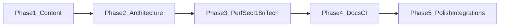

# WorldScript Studio — Global Audit & Best-Practices-Programm

## Prämisse (messbar statt absolut)

Das Repo ist bereits auf hohem Niveau ([`AUDIT.md`](AUDIT.md): Hybrid-AI, Dual-DB, Command Center, i18n×5 mit Key-Parität-CI, Lighthouse/Playwright/Stryker, Bundle-Budgets). Ein „Overhaul überall“ wird als **mehrstufiges Release-Programm** geführt: jede Phase hat **konkrete Exit-Kriterien** (Checks, Metriken, Review-Listen). **„Jede Zeile perfekt“** ist kein sinnvolles Gate; stattdessen: **P0-Invarianten** (Security/Privacy, Datenintegrität, keine regressions), **P1-Produktpolitur** (Inhalte, Tone, Konsistenz), **P2-Engineering-Exzellenz** (Typisierung, Tests pro Risiko), **P3-Zukunft** (RTL, Plugin-Skeleton).

---

## Schritt 1 — Audit-Matrix (alle Bereiche)

*Format pro Eintrag: **Ist** → **Lücken** → **Empfehlung** → **Priorität** (P0 kritisch … P3 strategisch).*

### Code & Architektur

- **Ist:** Redux Feature-Slices, getrennte Thunks, striktes TS (`strict`, `exactOptionalPropertyTypes` laut Projektregeln), Workspace-Packages (`@domain/*`), [`services/storageBackend.ts`](services/storageBackend.ts) als Kontrakt; Graphify-God-Nodes u. a. Storage/IndexedDB ([`graphify-out/GRAPH_REPORT.md`](graphify-out/GRAPH_REPORT.md)).
- **Lücken:** Rest-`any`/Legacy-Warnungen erwähnt in [`AUDIT.md`](AUDIT.md); nicht überall einheitliche Validierungsschicht (Import nutzt Valibot laut ROADMAP — **nicht** durchgängig Zod).
- **Empfehlung:** Validierung **grenzorientiert** standardisieren (Project-Import/Export, Settings-Exchange, AI-Antworten, externe JSON-Assets) mit **einem** gewählten Schema-Stack pro Schicht — Ziel ist Konsistenz, nicht „Zod überall“ ohne Nutzen. Magic Strings: kritische Domänenwerte in [`constants/`](constants/) bzw. Feature-Typen zentralisieren.
- **Priorität:** **P1** (Qualität/Wartbarkeit), ausgewählte Pfade **P0** wenn Security-relevant.

### Performance

- **Ist:** Lazy Views in [`App.tsx`](App.tsx), manuelle Chunks (laut Architektur-Doku), Bundle-Budget + Rollup-Analyse in CI ([`.github/workflows/ci.yml`](.github/workflows/ci.yml)), Lighthouse-Job nach Build.
- **Lücken:** „Core Web Vitals 98+“ ist abhängig von Gerät/PWA/Theme; Virtualisierung nicht pauschal überall nötig.
- **Empfehlung:** Lighthouse-Budgets und bestehende Jobs als **Regression-Gate** behalten; punktuell Profiling für große Listen (Manuskript/Szenen/Graph) und gezieltes Memo/`React.memo` nur nach Messung.
- **Priorität:** **P2**, Hotspots nach Messung **P1**.

### Security & Privacy

- **Ist:** BYOK, verschlüsselte Keys, lokaler Modus, Import-Validierung, Collaboration-Härtung (ROADMAP); CI `pnpm audit --audit-level=high`, Dependency Review auf PRs.
- **Lücken:** Nutzerbriefing „100 % lokal“ vs. Cloud-KI — in Marketing/README nuancieren (Offline-first ≠ alle Features ohne Netz). Prompt-Injection: generische LLM-Risiken brauchen **Produkt-/UX-Guidelines** + serverlose Mitigation (Systemprompts, Tool-Grenzen, keine Code-Eval).
- **Empfehlung:** Privacy-Copy in README/Help angleichen; AI-Pfade: klare Zustimmung/Labels; CSP/SRI: Web-Pfad ([`index.html`](index.html)/Vite-PWA) vs. Tauri separat auditieren; IndexedDB-Verschlüsselung als **Checkliste** (was ist verschlüsselt, was nur komprimiert) in Doku.
- **Priorität:** **P0** Copy-Nuance + sensible Defaults; **P1** restliche Härtung.

### i18n & L10n

- **Ist:** Module unter [`locales/<lang>/*.json`](locales/) + Build nach [`public/locales/<lang>/bundle.json`](public/locales/en/bundle.json); Gate [`scripts/check-i18n-keys.mjs`](scripts/check-i18n-keys.mjs) (`pnpm run i18n:check`) — **Key-Parität**, keine inhaltliche QA.
- **Lücken:** Kein automatisiertes Plural-/ICU-Modell in den JSON-Flat-Keys sichtbar; RTL nicht Teil der aktuellen Selector-Realität; **Community-Templates** ([`community-templates/index.json`](community-templates/index.json)) sind inhaltlich **DE-lastig** mit gemischten Tags (DE/EN), nicht locale-aware.
- **Empfehlung:** (1) Content-Pass FR/ES/IT auf Natürlichkeit/Länge/UI-Overflow. (2) Entscheidung: Templates entweder **neutral English master + Übersetzungstabellen** oder **pro Locale Datei** mit gleicher `id`. (3) Pluralregeln: wenn nötig, Schlüsselkonvention erweitern + kleine Hilfs-API in [`hooks/useTranslation.ts`](hooks/useTranslation.ts) — erst nach Bedarf. (4) RTL: Layout-Audit + `dir`-Hook vorbereiten, ohne neue Locale zu versprechen.
- **Priorität:** **P1** Inhalte + Template-Strategie; **P3** RTL.

### Testing & Quality

- **Ist:** Vitest + Coverage-Upload, Playwright E2E, axe Smoke ([`tests/e2e/a11y.spec.ts`](tests/e2e/a11y.spec.ts) — contrast in CI teils deaktiviert laut AUDIT), Visual Regression, Stryker informell (`continue-on-error`).
- **Lücken:** [`vitest.config.ts`](vitest.config.ts) setzt **sehr niedrige** globale Coverage-Thresholds (15 % Zeilen) — Gate schützt nicht vor Regressionen; „100 % für kritische Pfade“ ist ambitioniert aber sinnvoll **risikobasiert**.
- **Empfehlung:** **Tiered coverage**: strenge Schwellen für `services/dbService.ts`, Migration, `aiProviderService`, Import/Export; Gesamt-Schwelle moderat anheben. Mutation: Schwellen erst wenn Kill-Rate stabil. a11y: serious/critical bleiben Pflicht; Kontrast gezielt in Storybook/Theme-Tokens testen.
- **Priorität:** **P1** Threshold-Strategie; **P2** erweiterte E2E für Content-Flows.

### CI/CD

- **Ist:** Starke Pipeline ([`.github/workflows/ci.yml`](.github/workflows/ci.yml)), Renovate ([`renovate.json`](renovate.json)).
- **Lücken:** Kein dediziertes **Content-Lint** (Markdown/JSON Hilfsstrings/Tone); kein automatisierter **Übersetzungslängen**- oder **Forbidden-Term**-Check.
- **Empfehlung:** Kleine Node-Scripts oder bestehende Tools: `markdownlint`/`remark` nur wenn Team pflegt; **eigenes `scripts/content-guard.mjs`**: Community-JSON schema (id uniqueness, Pflichtfelder), EN-Leerstrings, maximale Tooltip-Länge; optional `alex`/`vale` nur bei klarer Regeldatei.
- **Priorität:** **P2** nach P1-Content-Konsolidierung.

### Documentation

- **Ist:** Documentation Hub in [`README.md`](README.md); [`AUDIT.md`](AUDIT.md), [`docs/CI.md`](docs/CI.md), Deployment, Tauri-Doku.
- **Lücken:** [`docs/BEST-PRACTICES.md`](docs/BEST-PRACTICES.md) existiert noch nicht (Ziel laut Auftrag).
- **Empfehlung:** Neues Dokument als **Single Source** für Engineering + Content-Guidelines + Release-Checkliste; README nur Verweis/ Kurzüberblick — Vermeidung von Duplikat-Romanen.
- **Priorität:** **P1**.

### UI/UX Patterns (Errors, Empty, Loading)

- **Ist:** [`components/ui/EmptyState.tsx`](components/ui/EmptyState.tsx), [`components/ui/Tooltip.tsx`](components/ui/Tooltip.tsx), Toasts mit `commandId` ([`features/status/statusSlice.ts`](features/status/statusSlice.ts)), Error Boundary mit Issue-Link (AUDIT).
- **Lücken:** Teilweise noch `alert()` im Demo-Flow ([`components/WelcomePortal.tsx`](components/WelcomePortal.tsx)) — bricht Tone/Konsistenz.
- **Empfehlung:** Einheitliche **Toast/Modal-Patterns** für Import-Erfolg/-Fehler; Empty States mit **Primary Action** + optional `tryActionId`-Bridge wie bei Help.
- **Priorität:** **P1**.

### Feature-Implementation (Querschnitt)

- **Ist:** Command Registry, Help-RAG-lite, Spotlight Tours (`services/spotlightTour.ts`), Settings Exchange (Zod).
- **Empfehlung:** Jede neue oder überarbeitete Oberfläche: Checkliste **i18n**, **a11y** (Label, `aria-live` bei Fehlern), **Keyboard**, **Offline-Fallback-Copy**.
- **Priorität:** **P1** als Definition of Done.

### App-Inhalte — Templates & Samples

- **Ist:** Demo-Projekt wird aus i18n gebaut ([`locales/*/portal.json`](locales/en/portal.json)); eingebaute Templates über [`locales/*/templates.json`](locales/en/templates.json) etc.; Community-Katalog statisch ([`public/community-templates/index.json`](public/community-templates/index.json)).
- **Lücken:** Community-Inhalt nicht multilingual; mögliche kulturelle Blind Spots (z. B. genre tropes); Tags inkonsistent sprachlich.
- **Empfehlung:** **Master-EN** + Übersetzungen oder **pro-Sprache-Kataloge** mit gleicher ID; Autoren/Fiktive Credits vereinheitlichen; Inklusionsreview (Repräsentation, Sensibilität bei Gewalt/Romance-Tags).
- **Priorität:** **P1** (vom Auftrag priorisiert).

### App-Inhalte — Help, Tour, FAQ, Command Palette

- **Ist:** [`locales/*/help.json`](locales/en/help.json), [`locales/*/tour.json`](locales/en/tour.json); Commands mit Metadaten in [`services/commands/`](services/commands/).
- **Lücken:** Vollständigkeit „Try it now“-Links nur wo `tryActionId` gesetzt; Konsistenz Begriffe (Outline vs. Plot vs. Struktur).
- **Empfehlung:** Help-Artikel-Schema dokumentieren (title, summary, body, tryActionId, verwandte Commands); Glossar pro Locale; Palette: einheitliche **Verb-First**-Benennung + Kurzbeschreibungen.
- **Priorität:** **P1**.

### App-Inhalte — README / CHANGELOG / ROADMAP / AUDIT

- **Ist:** Umfangreich und aktuell bis Mai 2026 in Teilen.
- **Lücken:** Emoji-/Marketing-Dichte vs. „premium tool“-Ton; Datenschutz-Aussagen präzisieren.
- **Empfehlung:** Kurze **Maintainer-Edition** oben (Facts, Setup, Links); Marketing-Abschnitte darunter; CHANGELOG strikt Conventional; AUDIT.md um **Content-Audit-Log** ergänzen nach Phasen.
- **Priorität:** **P2** (nach P1-Strings stabil).

---

## Best-Practices-Spezifikation — App-Inhalte (verbindlich für Umsetzung)

1. **Tone of Voice:** Deutsch/EN/FR/ES/IT — duzt **nur** wo Locale es bereits tut; professionell, ermutigend, keine Schulmeisterlichkeit; AI als **Co-Pilot**, nicht Ghostwriter (bestehende Positionierung beibehalten).
2. **Einheitliche Terminologie:** Festlegung eines **Glossars** (z. B. „Manuskript“, „Szene“, „Outline“, „Codex“, „Snapshot“) und Verwendung in Settings, Help und Commands.
3. **Struktur der Strings:** Bestehende Flat-Keys beibehalten; neue Keys nach Domain-Präfix (`portal.*`, `help.*`, `cmd.*` falls vorhanden). Keine HTML in JSON außer explizit erlaubt und sanitisiert.
4. **Fehler- und Erfolgsmeldungen:** Muster **Was ist passiert → Was jetzt tun → Optional Link/Command**; technische IDs nur in Logs ([`services/logger.ts`](services/logger.ts)).
5. **Empty States:** Immer **Primäraktion** + kurze Erklärung + optional sekundär (Docs/Tour); keine toten Enden.
6. **Onboarding:** Demo-Ladeflow ohne `alert`; klare Erfolgs-Toasts; Spotlight-Tour textlich mit Help verknüpfen.
7. **Inklusion & Sensibilität:** Templates/Beispiele diversifizieren; Trigger-Warnungen dort, wo Genre explizit dunkle Themen enthält (optional kurzer Hinweis im Template-Description-Feld).
8. **Community-Templates:** JSON-Schema + Review-Checkliste vor Merge; Sterne/Metadaten konsistent oder als „Community fictitious metrics“ kennzeichnen, falls nicht echt.

---

## Best-Practices-Spezifikation — Technik (zentrale Bereiche)

- **TypeScript:** Neue APIs ohne `any`; optional properties explizit `undefined` wo `exactOptionalPropertyTypes`.
- **Validation:** Grenzen: Netzwerk/Datei/User-JSON — Schema validieren; interne Redux-Transitions typsicher bleiben.
- **Performance:** Messgeführt optimieren; keine Virtualisierung ohne Nachweis.
- **Security:** Keine Secrets im Client; Minimierung von `dangerouslySetInnerHTML`; AI-Antworten nicht als Code ausführen (bestehendes Verbot beibehalten).
- **i18n-Prozess:** Änderungen immer in [`locales/*`](locales/) + `pnpm run i18n:check` + Bundle-Build; CI als Gate.
- **Testing:** Risikobasierte Coverage und ausgewählte E2E für „Content sichtbar“ (Sprachwechsel, Demo laden, Help öffnen).
- **Docs:** [`docs/BEST-PRACTICES.md`](docs/BEST-PRACTICES.md) mit: Architektur-Stichworte, Content-Guidelines, Security/Privacy-Kurzabriss, CI-Matrix-Verweis.

---

## Integration & „Extras“ (aus Auftrag, priorisiert)

- **Content Linting in CI:** Leichtgewichtiges Script + Schema für `community-templates` und statische Hilfs-JSON; später erweiterbar.
- **Changelog-Automatik:** Conventional Commits + `changesets` oder Release-Workflow evaluieren — nur wenn Release-Prozess der Maintainer das trägt (sonst manuell + strikte CONTRIBUTING-Regel).
- **Health Dashboard in Settings:** Als **dev/feature-flagged** Panel sinnvoll (Lighthouse/Bundle aus CI sind nicht zur Laufzeit verfügbar) — eher **Meta-Infos**: Locale, Storage-Backend, Feature-Flags, letzte Import-Validierung — kein falsches Versprechen „Live Lighthouse 98“.
- **Plugin-Vorbereitung:** Renowned stabile internal APIs dokumentieren (`storageService`, `commands` Registry, `featureFlags`); kein großes Plugin-Runtime-System ohne Produktentscheid.

---

## Phasenplan (Umsetzung nach Freigabe — Reihenfolge wie gewünscht)

- **Phase 1 — App-Inhalte (P1):** Glossar; Help/Tour/Portal/Commands/String-Audit; Community-Templates-Strategie + JSON-Schema; Demo-Flow von `alert` auf Toast; FR/ES/IT Qualitätspass.
- **Phase 2 — Code & Architektur (P1/P2):** Validierungsgrenzen; Constants für kritische Strings; Reduktion restlicher Schwachstellen aus AUDIT (ohne Big-Bang-Refactor).
- **Phase 3 — Performance / Security / i18n-Technik (P2/P0 wo nötig):** Privacy-Copy; CSP/SRI/Tauri-Review; risikobasierte Tests/Coverage; gezielte Performance-Messungen.
- **Phase 4 — Docs & CI (P2):** [`docs/BEST-PRACTICES.md`](docs/BEST-PRACTICES.md); AUDIT.md Ergänzungen; Content-Guard in CI; optional Changelog-Automation.
- **Phase 5 — Integration & Polish (P3):** „Health“-Panel unter Flag; Help↔Commands↔Tour Verdichtung; RTL-Vorbereitung dokumentieren.

---

## Wichtige Repo-Dateien (Anker)

| Zweck | Dateien |
|-------|---------|
| i18n Quelle / Gate | [`locales/`](locales/), [`scripts/check-i18n-keys.mjs`](scripts/check-i18n-keys.mjs), [`scripts/build-i18n.mjs`](scripts/build-i18n.mjs) |
| Onboarding / Demo | [`components/WelcomePortal.tsx`](components/WelcomePortal.tsx), [`locales/*/portal.json`](locales/en/portal.json) |
| Help / Tour | [`locales/*/help.json`](locales/en/help.json), [`locales/*/tour.json`](locales/en/tour.json), [`services/help/helpDocRetrieval.ts`](services/help/helpDocRetrieval.ts), [`services/spotlightTour.ts`](services/spotlightTour.ts) |
| Commands | [`services/commands/`](services/commands/), [`components/CommandPalette.tsx`](components/CommandPalette.tsx) |
| Community Templates | [`community-templates/index.json`](community-templates/index.json), [`public/community-templates/index.json`](public/community-templates/index.json) |
| CI | [`.github/workflows/ci.yml`](.github/workflows/ci.yml) |
| Bestehende Audits | [`AUDIT.md`](AUDIT.md), [`TODO.md`](TODO.md), [`ROADMAP.md`](ROADMAP.md) |

*(Tabelle nur zur Navigation — im Daily-Betrieb Prioritäten aus Fließtext oben.)*

---

## Exit-Kriterien (Beispiele)

- **Phase 1:** Keine rohen fehlenden Keys; Community-JSON validiert; Demo ohne `alert`; Glossar in [`docs/BEST-PRACTICES.md`](docs/BEST-PRACTICES.md) verlinkt.
- **Phase 3:** Privacy-Aussagen konsistent; kritische Services mit höheren Coverage-Limits oder expliziten Exclude-Begründungen dokumentiert.
- **Phase 4:** CI job „content-guard“ grün; AUDIT.md enthält Content-Audit-Section mit Datum.
