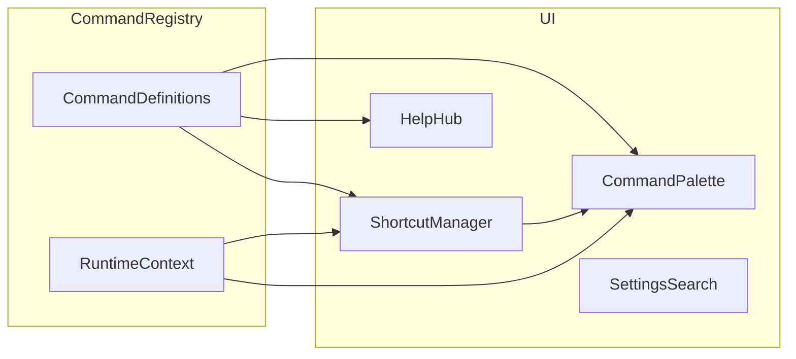

# WorldScript Studio: Helper-Layer & Command-Center (Audit + Spezifikation)

## Kontext aus dem Code (relevant für das Mapping)

- **Command Palette:** [`components/CommandPalette.tsx`](components/CommandPalette.tsx) – statische `useMemo`-Commandliste, einfache Substring-Filterung, Kategorien (Navigation, Actions, AI, Characters, Worlds, Settings), Sprach-/Theme-Umschaltung, **bereits** Voice-Input via [`hooks/useSpeechRecognition.ts`](hooks/useSpeechRecognition.ts). Öffnen in [`App.tsx`](App.tsx) mit lokalem `useState`; **Zustand-Duplikat** in [`app/transientUiStore.ts`](app/transientUiStore.ts) (`isCommandPaletteOpen`) wird für die Palette **nicht** genutzt.
- **Shortcuts:** [`features/settings/settingsSlice.ts`](features/settings/settingsSlice.ts) + [`types.ts`](types.ts) (`KeyboardShortcut`) – Default-Liste mit `save`, `new-section`, `search`, `export`; **keine** UI in [`components/settings/`](components/settings/). Kein zentraler Global-Shortcut-Router, der diese Liste auswertet.
- **Settings:** Viele Kategorien bereits vorhanden (General, Appearance, Editor, Advanced Editor, AI, Advanced AI, Accessibility, Privacy, Performance, Notifications, Collaboration, Integrations, Backup, Data, About) – siehe [`components/SettingsView.tsx`](components/SettingsView.tsx). Es fehlen vor allem **globale Suche**, **Shortcuts-Sektion**, und **kohärente „Hub“-Patterns** (Preview, Empfehlungen).
- **Help:** [`components/HelpView.tsx`](components/HelpView.tsx) + [`hooks/useHelpView.ts`](hooks/useHelpView.ts) – Kategorien/Artikel aus i18n (`help.categories`), AI-Chat via `streamAiHelpResponse` ([`services/aiProviderService.ts`](services/aiProviderService.ts)); Tour: [`services/spotlightTour.ts`](services/spotlightTour.ts).
- **Sekundär:** Toasts [`components/ui/Toast.tsx`](components/ui/Toast.tsx) + Redux [`features/status/statusSlice.ts`](features/status/statusSlice.ts); Modal [`components/ui/Modal.tsx`](components/ui/Modal.tsx); Tooltips größtenteils **`title`-Attribute**, keine gemeinsame Tooltip-Komponente.

---

## 1. Feature-Mapping (Ist → Geplant)

*Ohne Tabellenform gemäß Plan-Format; jede Zeile: **Bereich → Ist → Geplant + Lücken/Redundanzen**.*

### Kern & Navigation

- **Views / Sidebar:** Vollständige View-Liste über Redux/Routing wie heute → unveränderte Navigation; **Erweiterung:** Jede View registriert optional **contextuelle Commands** und **Help-Artikel-IDs** für Palette und Help (siehe Architektur unten).

### Command Palette

- **Ist:** Monolithische Komponente; substring-Match; keine Recent/Pinned; Shortcut-Feld bei AI-Einträgen nur Anzeige-Konzept (`shortcut` Array), keine Fuzzy-Highlighting; kein Preview-Panel; kein „Editor Commands“-Layer (Manuscript-spezifisch).
- **Geplant:** Zentrales **Command Registry** (typisiert, i18n-Labels, Kategorie, Keywords, `when`-Predicate für Kontext); **Fuzzy-Search** (z. B. eigene Levenshtein/subsequence oder kleine Lib) mit **Highlight** der Treffer; **Sections** mit Icons; **Recent** + **Pinned** (IndexedDB oder LocalStorage, versioniert); **Shortcut-Badges** aus gebundenem Shortcut-Manager; optionale **rechte Preview-Spalte** (Metadaten, Shortcut, „Jump to related settings“); **AI-Suggested** Zeile(n) basierend auf Projektmetadaten (letzte Szene, offene Konflikte, Wortziel) – nur wenn kein Bloat: max. 3 Vorschläge, dismissierbar; Voice bleibt; **Deep-Link** für Character/World-Einträge statt nur View-Wechsel (schrittweise).

### Settings

- **Ist:** Viele Sektionen, Sidebar-Nav, kein übergeordnetes Suchfeld; `keyboardShortcuts` ohne UI; Appearance ohne durchgängige „Live Preview“-Fläche für alle Effekte.
- **Geplant:** Oben **Suchleiste** (filtert Sektionen + einzelne Controls über registrierte Metadaten); neue Kategorie **Shortcuts** (Recording, Konflikt-Erkennung gegen globale Browser/OS-Reserve und interne Duplikate); optional **Presets** für Appearance (nutzt bestehendes `appearancePreset`); **Import/Export** von Settings-JSON (Zod-validiert, bestehende Privacy-Trennung beachten); **Empfehlungen** (z. B. „Reduced motion“ wenn `prefers-reduced-motion`).

### Help / Tour / Dokumentation

- **Ist:** Statische Artikel aus Locale-Bundles; AI-Chat generisch; Tour mit driver.js, begrenzte `data-tour`-Ziele.
- **Geplant:** **Einheitlicher Help-Index** (weiterhin i18n-first); durchsuchbar; Artikel mit **`tryActionId`** (ruft registrierten Command aus); **RAG:** Embedding/Chunking einer **internen Doc-Corpus** (Markdown oder JSON unter `docs/` oder generiert aus gleichen Keys) – Retrieval vor LLM-Aufruf in [`streamAiHelpResponse`](services/aiProviderService.ts) oder dedizierter Hilfe-Route; Quellenangaben im Chat; **Guided Workflows** als Tour-„Presets“ (mehrere driver-Fahrten statt einer starren Tour).

### Toasts / Notifications

- **Ist:** Drei Typen, Auto-Dismiss 5s, Redux-Liste, ein Stack unten rechts; kein Undo, keine Gruppierung.
- **Geplant:** API-Erweiterung um optionales **`action`** / **`onUndo`**; **Stack-Limit** und Kollaps; reduzierte Bewegung bei `accessibility.reducedMotion`; gleiche Tokens wie Modals (Glass/Backdrop).

### Modals / Drawer

- **Ist:** Modal mit Fokus/Escape in [`components/ui/Modal.tsx`](components/ui/Modal.tsx); diverse Feature-Modals verstreut.
- **Geplant:** Einheitliche **Größenvarianten**, **aria-labelledby**, konsistente Primary/Secondary-Buttons; optional **`ModalProvider`** nur wenn es die Duplikate reduziert (sonst: gemeinsame Hooks/`ConfirmDialog`).

### Tooltips

- **Ist:** Überwiegend `title`.
- **Geplant:** **`Tooltip`-Komponente** (Positioning, Delay, Escape-Taste schließt, Tastatur-Hint-Zeile); Integration mit Shortcut-Manager für „⌘K Search“-Pattern.

### Empty States / Loading

- **Ist:** Uneinheitlich je View; Skeleton-Komponente vorhanden ([`components/ui/Skeleton.tsx`](components/ui/Skeleton.tsx) – zu verifizieren im Rollout).
- **Geplant:** **`EmptyState`-Primitive** (Illustration optional, Primär-/Sekundär-CTA, Link zu Help-Artikel); **AI-Thinking** State mit bestehendem Design-System (kein Pflicht-„Sparkle“, aber konsistente Variante wenn `reducedMotion` false).

### Onboarding / First Run

- **Ist:** Spotlight Tour + Dashboard-Einstieg.
- **Geplant:** **Checkliste** (z. B. „Projekt angelegt“, „Erste Szene“, „Palette probiert“) mit LocalStorage; Resume der Tour; Überspringen wie heute erhalten.

### Error Handling

- **Ist:** [`components/ui/ErrorBoundary.tsx`](components/ui/ErrorBoundary.tsx) + i18n-Keys.
- **Geplant:** Zusätzlich **„Report Issue“** (mailto oder vorbereitete GitHub-Issue-URL mit Template), **Kontext** (View, Locale); optionales Kopieren der Stack-ID.

### Accessibility / Global Shortcuts

- **Ist:** Settings-Felder in Slice (`accessibility.*`); keine zentrale Durchsetzung überall.
- **Geplant:** **`useReducedMotion` / `useHighContrast`** Hook liest Settings + System-Media; Shortcut-**einheitlicher Listener** (ein Modul) + **Konflikt-UI**; Screen-Reader: Palette als **Combobox/Listbox** ARIA-Muster.

### Sonstiges (optional, nicht im ersten Sprint)

- Undo/Redo History Viewer, Debug-Leiste, Analytics/Privacy-Dashboard: erst nach Priorität 1–2; mit Feature-Flags ([`features/featureFlags/featureFlagsSlice.ts`](features/featureFlags/featureFlagsSlice.ts)) koppelbar.

---

## 2. Detaillierte Spezifikation: Command Palette (Weltklasse-Zielbild)

### Informationsarchitektur

- **Kategorien (Pflicht):** `Navigation`, `AIActions`, `ProjectManagement`, `Editor`, `Settings`, `Help`, `Global`, `CustomUser`.
- **Command-Datenmodell (Vorschlag):** `id`, `titleKey`, `subtitleKey?`, `keywords[]`, `category`, `icon`, `shortcutId?`, `when?: (ctx) => boolean`, `run: (ctx) => void`, `preview?: ReactNode | previewKey`, `telemetry?: safe meta`.

### Interaktion

- Öffnen: **⌘/Ctrl+K** (bestehend) + optional zweites Shortcut aus Settings.
- Navigation: Pfeile, Enter, Esc schließt; **Tab** optional zwischen „Ergebnisliste“ und „Preview“ wenn Preview aktiv.
- **Fuzzy ranking:** Titel > Keywords > Kategorie; Recent/Pinned Boost.
- **recentCommands:** max. 15 IDs; **pinnedCommands:** max. 20; beide UI-togglebar (Pin im Kontextmenü oder Shortcut).

### AI-Suggestions

- Input: aktuelle `View`, aktive `projectId`, Aggregates (Wortanzahl, letzte Änderung, offene TODOs wenn vorhanden).
- Output: 0–3 Commands aus Registry mit kurzer Begründung (lokalisiert Template).
- Kein zusätzlicher Netzwerk-Call Pflicht – optional ein langsamer „smart refresh“ Call später.

### Voice

- Bestehendes Verhalten beibehalten; bei aktivem Mikrofon visuelles Signal vereinheitlichen mit anderen Loading-States.

### Performance

- Commandliste **memoized**; teure „world/character“ Einträge optional virtualisiert oder erst ab Query-Länge ≥ 2 einblenden.

---

## 3. Detaillierte Spezifikation: Settings-Hub

### IA

- Bestehende Kategorien beibehalten; **neu:** `Shortcuts` (eigener Nav-Eintrag).
- **Globale Suche:** durchsucht Titel von Controls + `descriptionKey`; Implementierung über ein **settingsSearchIndex** (beim Build oder zur Laufzeit aus Section-Metadaten).

### Shortcuts-UI

- Liste aller **Shortcut-fähigen Aktionen** (Superset aus Registry); pro Zeile: Aktion, aktuelle Kombination, „Aufnehmen“, Zurücksetzen.
- **Konflikt:** Warnung bei Duplikat oder Reservierung (Palette, Browser, OS); kein Speichern bis aufgelöst oder „Trotzdem“ mit Warnung.

### Live Preview

- Appearance: Split oder Sticky-Preview mit Manuscript-Mini-Editor oder Theme-Swatch (minimal viable: Typography + Theme).

### Import/Export

- Zod-Schema `SettingsExportSchema` (partial allowed); Export ohne sensible API-Keys (falls später im Slice – aktuell Keys prüfen).

---

## 4. Detaillierte Spezifikation: Help-Hub

### UX

- Links: Kategorien; oben: **Suche** über Titel/Inhalt (client-side Index).
- Artikel: „**Jetzt ausprobieren**“ ruft `executeCommand('…')` wenn `tryActionId` gesetzt.
- AI-Panel: **RAG-Kontext** aus Hilfe-Corpus + optional Projekt-Glossar; Antwort mit **Quellenliste** (Artikel-Titel).

### Tour

- `spotlightTour.ts` erweitern um **mehrere Tour-IDs** und Schrittfolgen aus Konfiguration; Dashboard/Help starten spezifische IDs.

---

## 5. Sekundäre Hilfsfunktionen (gemeinsames Design-System)

- **Tooltip:** eine Komponente, überall `title` schrittweise ersetzen (priorisiert Header, Palette, Settings).
- **Toast:** erweiterte Notification-Struktur in [`features/status/statusSlice.ts`](features/status/statusSlice.ts) (`actionLabel`, `onAction` serialisierbar vermeiden – besser: `actionId` aus Registry).
- **EmptyState / Loading:** zwei Primitive unter [`components/ui/`](components/ui/) + schrittweise Adoption in Haupt-Views (Manuscript, Characters, …).

---

## 6. Architektur-Skizze (Ziel)

- **Single source of truth** für ausführbare Aktionen: Registry importiert von Features schlanke Registrierungsmodule (`features/manuscript/registerCommands.ts` etc.), um zirkuläre Imports zu vermeiden.

---

## 7. Priorisierte Umsetzung (nach deiner Vorgabe)

1. **Registry + ShortcutManager + Palette-Refactor + Settings-Suche + Shortcuts-UI + Help-Suche/Try-it + Tooltip/Toast-Basis.**
2. **Kern-Views:** Empty States, kontextuelle Hilfe-Links, Loading-Vereinheitlichung.
3. **Polish & optionale Features:** RAG-Feinschliff, Preview-Spalte, Project Health, Reading Mode, Cross-Project Search – jeweils mit Feature-Flags und Doc/Help-Anbindung.

---

## 8. Risiken und Prinzipien

- **Keine Regression:** Alle bestehenden Palette-Aktionen müssen IDs behalten oder migriert werden (Tests: [`tests/e2e/helpers.ts`](tests/e2e/helpers.ts), Unit wo vorhanden).
- **i18n:** Neue Keys in allen Locale-Trees + `pnpm run i18n:bundle` (siehe [`CLAUDE.md`](CLAUDE.md)).
- **Kein Feature-Bloat:** Jede neue Oberfläche braucht einen Command + Help-Eintrag oder wird hinter Flag gestellt.
