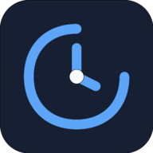

[](https://deepwiki.com/qnbs/WorldScript-Studio)

<p align="center">
  
</p>

<h1 align="center">WorldScript Studio</h1>

<p align="center">
  <strong>Local-first, offline-capable, AI-assisted creative writing studio for novels, screenplays, worlds, characters, research, revision, and export.</strong>
</p>

<p align="center">
  <a href="https://qnbs.github.io/WorldScript-Studio/"></a>
  <a href="https://worldscript-studio.vercel.app/"></a>
  <a href="https://qnbs.gitbook.io/worldscript-studio/"></a>
  
  
  
  
  
  
  
  
  
  
</p>

---

## Overview

**WorldScript Studio** is an open-source creative-writing workspace designed around three principles:

1. **Local-first project ownership** — there is no WorldScript user account or central manuscript database. Project state is stored locally in the browser/PWA or in the desktop app's local data directory.
2. **Offline-capable core writing** — once the PWA shell is cached, writing, planning, project management, and many analysis tools remain useful without a network connection. Cloud AI, collaboration, first-time model downloads, and other explicitly networked integrations naturally require connectivity.
3. **AI is optional infrastructure, not the product's source of truth** — the manuscript and project model remain authoritative. You can use cloud BYOK providers, browser-native models, local model servers, heuristics, or no AI at all.

WorldScript Studio combines a manuscript editor, visual plot planning, character and world dossiers, story-bible tooling, research and revision surfaces, progress analytics, AI writing tools, local inference, collaboration, publishing/export workflows, and a Tauri desktop shell in one project-centered application.

> [!IMPORTANT]
> **"Local-first" does not mean "nothing ever uses the network."** Project persistence is local by default, but cloud AI providers, the Claude web proxy, real-time collaboration signaling, optional LanguageTool servers, model downloads, update checks, and other explicitly enabled integrations can create network traffic. The sections below document those boundaries precisely.

---

## Try it

| Surface | URL / entry point | Important differences |
| --- | --- | --- |
| **GitHub Pages** | **https://qnbs.github.io/WorldScript-Studio/** | Canonical static upstream deployment. No serverless API functions; **Claude is unavailable on this host**. GitHub Pages also cannot inject HTTP security headers, so the app relies on its meta CSP there. |
| **Vercel** | **https://worldscript-studio.vercel.app/** | Edge-hosted deployment with root-path build, response security headers, and the same-origin Claude serverless relay. |
| **PWA** | Install from a supported browser | Offline-capable app shell after caching; local browser storage remains origin-specific. |
| **Tauri desktop** | Tagged GitHub Releases / local `pnpm run tauri:dev` | Local filesystem project persistence, native HTTP for admitted local/cloud endpoints, native menu/window integration, updater plumbing. See the desktop security caveat below. |

The web deployments share the same application codebase, but they are **not operationally identical** because their hosting capabilities differ.

### 60-second quick start

1. Open **GitHub Pages** or **Vercel**.
2. From the Welcome Portal, open the demo project or start a blank project.
3. Go to **Manuscript** and start writing.
4. Press **`Ctrl+K`** (Windows/Linux) or **`⌘K`** (macOS) to open the Command Palette.
5. AI is optional:
   - use a configured BYOK cloud provider;
   - download a browser-native local model;
   - use Ollama/local-server inference where supported;
   - or keep AI disabled.

No WorldScript account is required.

**Documentation:** the curated public documentation is available in **[English](https://qnbs.gitbook.io/worldscript-studio/)** and **[Deutsch](https://qnbs.gitbook.io/worldscript-studio/de/)**. **[DeepWiki](https://deepwiki.com/qnbs/WorldScript-Studio)** provides an additional code-derived repository view. Repository source, current ADRs, security documents, configuration, and CI remain the engineering/source-truth layer; GitBook is the polished reader-oriented documentation surface.

---

## Table of contents

- [What makes WorldScript Studio different](#what-makes-worldscript-studio-different)
- [Product tour](#product-tour)
- [Feature maturity and flags](#feature-maturity-and-flags)
- [AI architecture](#ai-architecture)
- [Privacy, storage, and security](#privacy-storage-and-security)
- [Offline and local-first semantics](#offline-and-local-first-semantics)
- [Export and publishing](#export-and-publishing)
- [Collaboration](#collaboration)
- [Languages and accessibility](#languages-and-accessibility)
- [Web, PWA, and desktop](#web-pwa-and-desktop)
- [Technology stack](#technology-stack)
- [Architecture at a glance](#architecture-at-a-glance)
- [Repository structure](#repository-structure)
- [Getting started for development](#getting-started-for-development)
- [Validation and CI](#validation-and-ci)
- [Deployment](#deployment)
- [Known limitations and truth boundaries](#known-limitations-and-truth-boundaries)
- [Roadmap](#roadmap)
- [Contributing](#contributing)
- [Security reporting](#security-reporting)
- [Documentation Hub](#-documentation-hub)
- [License and disclaimer](#license-and-disclaimer)

---

## What makes WorldScript Studio different

### A writing application first

AI is integrated throughout the product, but the central object is still the **project**: manuscript sections, characters, worlds, plot structure, comments, snapshots, research, goals, export settings, and related metadata.

The application is intended to remain useful when:
- no API key is configured;
- no cloud provider is reachable;
- local AI has not been downloaded;
- AI features are deliberately disabled.

### Privacy-oriented without pretending the network does not exist

WorldScript does not require:
- a WorldScript account;
- server-side manuscript persistence;
- a central project database;
- mandatory cloud AI.

When you choose a networked feature, that boundary is made explicit:
- cloud AI sends the prompt/context required for that request to the selected provider;
- browser-native AI downloads model assets before local inference is possible;
- collaboration uses signaling infrastructure to establish peer connections;
- self-hosted LanguageTool receives the text you explicitly send for checking;
- Claude on Vercel/Cloudflare Pages transits WorldScript's same-origin relay.

### One workspace from idea to export

The product spans:
- ideation and templates;
- outlining and scene planning;
- characters and worldbuilding;
- manuscript drafting;
- AI-assisted revision and analysis;
- research and binder material;
- comments and scene revision history;
- progress tracking;
- consistency/RAG tooling;
- preview, compile, and export.

---

# Product tour

## Welcome Portal and project bootstrap

The Welcome Portal is the first-run/project-entry surface. It can:
- open a blank project;
- load the demo project;
- direct the user to templates and guided workflows;
- explain local-first/offline behavior;
- be reopened from Settings.

Project imports, resets, and snapshot restores are treated as real project-incarnation changes rather than simple page navigation.

## Dashboard

The Dashboard provides a project-level overview with local calculations for:
- current word counts and goals;
- writing momentum and streaks;
- pace/deadline projections;
- manuscript composition;
- reading-time and scene metrics;
- optional Project Health scoring;
- shortcuts back into active writing.

These calculations do not require a cloud AI call.

## Manuscript editor

The Manuscript view is the primary writing surface:
- chapter/section navigation;
- editor + surrounding project context;
- `@character` and `#world` linking/highlighting;
- scene notes and references;
- threaded comments;
- per-scene revision history and diffs;
- keyboard-first navigation;
- Zen/Flow-oriented distraction reduction;
- optional grammar/spell integration through a configured LanguageTool server.

LanguageTool is **off by default** and should be treated as a network boundary unless the configured server is genuinely local to the device.

## Writer / AI Writing Studio

The Writer surface exposes focused AI-assisted writing operations such as:
- continue writing;
- improve/rewrite;
- tone transformation;
- dialogue generation;
- brainstorming;
- synopsis generation;
- grammar/style-oriented review;
- critique;
- plot-hole analysis;
- consistency assistance.

Underlying execution follows the currently selected AI provider/mode. The UI does not imply that every tool has identical capability or fallback semantics across every provider.

## Outline Generator

The Outline Generator builds and edits structured story outlines and can apply an outline to the manuscript.

AI-generated outline previews are treated as project-owned results; project identity remains authoritative when applying generated content.

## Plot Board v2

Three visual planning modes coexist:

| Mode | Purpose |
| --- | --- |
| **Swimlane** | Kanban-style scene organization across structural lanes |
| **Canvas** | Free-form pan/zoom spatial planning |
| **Timeline** | Timeline/Gantt-style story sequencing |

Additional planning layers include:
- scene connections;
- subplot filtering;
- tension-curve visualization;
- beat-sheet markers;
- mini-map support;
- drag/drop planning.

## Scenario workspace

The **Scenario** view is a renderer-neutral, read-only projection of the canonical project model. It summarizes:
- characters;
- worlds;
- outline entries;
- scenes;
- manuscript word count;
- projected manuscript sections.

It intentionally does **not** become a competing source of project truth.

## Characters

Character dossiers support:
- identity and descriptive fields;
- backstory and motivations;
- relationships and arcs;
- roster search/sort;
- completeness indicators;
- AI profile generation;
- AI-generated portraits;
- Character Interviews v2 where enabled.

## Worlds

Worldbuilding surfaces support:
- history/lore;
- geography;
- locations;
- systems/technology/magic concepts;
- timelines;
- roster/search/sort;
- completeness indicators;
- AI world generation;
- AI-generated ambiance images.

## Character relationship graph

A force-directed graph visualizes relationships across the cast for complex story networks and multi-POV projects.

## Templates

The template library includes structural and genre-oriented starting points, including classic narrative structures. Templates can be adapted and, when AI is configured, personalized.

Community template assets live with the application rather than requiring a WorldScript account marketplace.

## Story Objects & Groups

A dedicated inventory can track props, artifacts, vehicles, documents, weapons, and other story objects, with grouping/tagging for larger projects.

## Mind Maps

Enhanced mind maps provide an SVG planning canvas with:
- multiple node shapes;
- entity links;
- multi-map management;
- visual brainstorming across plot/world/research concepts.

## Research Binder

The Research Binder keeps reference material adjacent to the manuscript and project instead of requiring a separate research application.

## Book Preview

The Preview view renders the manuscript as continuous formatted prose with:
- a navigable table of contents;
- display/font controls;
- full-screen reading;
- export handoff.

## Progress Tracker

The Progress view includes:
- daily/weekly goals;
- writing-session timer;
- streaks;
- velocity visualization;
- activity heatmap;
- writing-history-driven summaries.


## Voice and dictation

Voice support is an **explicit opt-in capability** because microphone access is a privacy and permission boundary.

Current voice layers include:
- browser speech capabilities where available;
- optional local WASM/ONNX voice components behind a separate opt-in;
- voice commands/dictation only after the corresponding feature is enabled and permissions are granted.

The main `enableVoiceSupport` flag and the heavier `enableVoiceWasm` path are both **off by default**. Local voice-model assets can require a substantial first download and compatible browser/runtime capabilities.

Voice should not be interpreted as a mandatory part of the writing workflow: the complete core editor remains usable without microphone access.

## Cross-project search

Cross-project search uses a lightweight local index for fast discovery:
- the persistent index stores project metadata rather than full manuscript plaintext;
- deeper excerpts require loading the project on demand;
- indexing is updated as projects are saved.

## Story Bible / consistency tooling

WorldScript combines structured project entities, RAG/consistency tooling, and story-bible-style links so AI and local analysis can reason over project context instead of treating each prompt as an isolated text box.

---

# Feature maturity and flags

WorldScript deliberately distinguishes **available**, **default-on**, and **mature**. A feature being enabled by default does not automatically mean it has identical qualification depth on every platform.

The current `FeatureFlagsState` contains the following feature authorities:

| Flag | Default | Role / maturity note |
| --- | :---: | --- |
| `enableStoryBibleAdvanced` | ✅ | Story-bible graph/consistency features |
| `enableBinderResearch` | ✅ | Research Binder |
| `enableCompileWizard` | ✅ | Guided export/compile flow |
| `enableProjectHealthScore` | ✅ | Dashboard health insights |
| `enableAppHealthPanel` | ✅ | Runtime diagnostics in About |
| `enableDuckDbAnalytics` | ✅ | Local DuckDB-WASM analytics sidecar; see privacy caveats |
| `enableObjectsGroups` | ✅ | Story Objects & Groups |
| `enableMindMaps` | ✅ | Enhanced Mind Maps |
| `enableCharacterInterviews` | ✅ | Character Interviews v2 |
| `enableLoraAdapters` | ✅ | LoRA adapter tooling; advanced/experimental |
| `enablePluginSystem` | ✅ | Worker-isolated permission-gated plugin system; still an advanced extension surface |
| `enableIdbAtRestEncryption` | ✅ | Browser/PWA IDB encryption capability; passphrase setup controls actual encryption state |
| `enableAdaptiveAiEngine` | ✅ | Device-aware AI backend/model selection |
| `enableComputeShaders` | ✅ | Experimental WebGPU compute path; do not assume every advertised acceleration path is active on every device |
| `enableWorkerBusV2` | ✅ | Shared background task orchestration |
| `enableRtlLayout` | ❌ | Manual RTL-layout test override |
| `enableVoiceSupport` | ❌ | Voice commands/dictation; explicit permission boundary |
| `enableProForge` | ❌ | Token-heavy experimental agentic editorial pipeline |
| `enableVoiceWasm` | ❌ | Local voice WASM models; explicit download/opt-in |
| `enableRustCompute` | ❌ | Desktop qualification wrappers; no general production caller |
| `enableGlobalCopilot` | ❌ | Ambient Global AI Copilot |
| `enableLocalFirstSync` | ❌ | Experimental Yjs shadow projection; Redux remains source of truth |
| `enableBrowserOllama` | ❌ | Advanced browser→Ollama opt-in; requires user-managed CORS/origin configuration |

Two earlier flags were intentionally retired:
- cross-project search is permanent core behavior;
- the previous Cloud Sync toggle was removed because there is no finished central Cloud Sync product/UI.

---

# AI architecture

## Provider families

WorldScript supports several execution families rather than one mandatory AI backend.

### BYOK cloud providers

Current provider integrations include:
- Google Gemini;
- OpenAI;
- Anthropic Claude;
- xAI/Grok;
- OpenRouter.

Provider model catalogs evolve faster than a README should. **The runtime Settings catalog and provider source are authoritative for currently admitted model IDs.** This README intentionally avoids freezing rapidly changing model names into long-lived documentation.

### Local-server providers

The desktop application can talk to local OpenAI-compatible/server-style runtimes, including:
- Ollama;
- LM Studio;
- vLLM-compatible endpoints.

Desktop traffic uses the native Tauri HTTP transport for admitted endpoints.

Direct browser→Ollama is a separate advanced feature:
- off by default;
- no automatic localhost probing while off;
- requires the user to configure the local server's CORS/origin policy if enabled;
- should not be mistaken for the default PWA behavior.

### Browser-native inference

The local browser stack includes:
1. **WebLLM / WebGPU**
2. **ONNX Runtime Web / WASM**
3. **Transformers.js / WebGPU or WASM**
4. **heuristic fallbacks** for supported flows

Initial model acquisition requires network access and can involve hundreds of megabytes or more. Once the required model assets are cached, model inference itself runs on-device.

> [!NOTE]
> Local fallbacks are **capability-specific**. "A heuristic exists" does not mean every cloud-model feature has an equivalent offline result of the same quality.

## AI execution modes

The routing service currently implements these semantics:

| Mode | Current routing intent |
| --- | --- |
| **Hybrid** | Cloud-first while online; local fallback when the browser reports offline |
| **Cloud** | Cloud path while online; local fallback when offline |
| **Local** | Local/on-device path only; every cloud provider call is blocked outright (`assertCloudAiAllowed` rejects with `AI mode is "local" (local-only)`) |
| **Eco** | Small local model / heuristic-oriented path for constrained devices; cloud provider calls are blocked identically to Local (`assertCloudAiAllowed` rejects Eco the same way) — Eco is a strict no-cloud mode, not merely a battery/cost optimization |

If you require AI execution that never intentionally calls a cloud provider, use **Local or Eco** — both are enforced as strict no-cloud modes at the same policy gate.

## Claude host-specific behavior

Claude has a different browser trust boundary from other providers:

| Surface | Claude path |
| --- | --- |
| **Tauri desktop** | Direct native HTTP request to Anthropic |
| **Vercel / Cloudflare Pages** | Same-origin WorldScript serverless relay → Anthropic |
| **GitHub Pages** | Unavailable; static hosting cannot run the relay |

On edge hosts, the BYOK key, prompt, and response transit the WorldScript relay process. The **application relay code is designed not to persist or intentionally log those payloads**, but hosting/network infrastructure can still process connection metadata according to the host's own policies.

See:
- [`docs/SECURITY-THREAT-MODEL.md`](docs/SECURITY-THREAT-MODEL.md)
- [`docs/adr/0016-native-grok-and-claude-providers.md`](docs/adr/0016-native-grok-and-claude-providers.md)

## ProForge

ProForge is an optional eight-stage Human-in-the-Loop editorial pipeline.

Important boundary:
- pipeline orchestration, review state, and author approval are client-side;
- the model calls used by pipeline agents still follow the configured AI provider/routing policy;
- it is therefore inaccurate to describe ProForge as inherently "no-cloud" unless Local/Eco mode or a local provider is actually selected.

## Global Copilot

The Global Copilot is opt-in and can:
- operate as a floating dialog or docked sidebar;
- render structured Markdown safely;
- surface local heuristic insights;
- apply sufficiently large fenced outputs to a chapter through undoable project state;
- integrate with ProForge review items.

A heuristics-only mode exists for local non-model assistance.

---

# Privacy, storage, and security


## Security model: separate trust boundaries

WorldScript security is layered rather than represented by one blanket **"private"**, **"local"**, or **"encrypted"** guarantee.

Treat these as separate security authorities:

| Boundary | What it governs |
| --- | --- |
| **Project persistence** | Where manuscript/project data is stored and whether that surface is protected at rest |
| **Secret storage** | API credentials and other dedicated secrets |
| **AI execution** | Browser-local, local-network, direct cloud-provider, and WorldScript-relay request paths |
| **Collaboration** | Room-key/content encryption versus signaling/connection metadata |
| **Analytics** | DuckDB/OPFS persistence and the distinction between local metadata and encrypted cells |
| **Exports/backups** | User-controlled artifacts and passphrase-protected library backup |
| **Desktop filesystem** | Native local files and the current absence of WorldScript application-level at-rest encryption there |
| **Deployment infrastructure** | Host-specific CSP, headers, serverless relay capability, updates, and release provenance |

A guarantee in one row must never be generalized to another. For the detailed threat model and current security-truth reconciliation, see [`docs/SECURITY-THREAT-MODEL.md`](docs/SECURITY-THREAT-MODEL.md) and the repository security documentation.

## No central WorldScript account or manuscript backend

Today, WorldScript Studio does **not** require:
- account registration;
- central manuscript hosting;
- a WorldScript cloud project database;
- mandatory sync.

That is a product-architecture statement, not a claim that the application never connects to external services.

## Storage by platform

| Data class | Browser / PWA | Tauri desktop |
| --- | --- | --- |
| Project/state persistence | IndexedDB | Local filesystem under app data |
| Snapshots/assets | IndexedDB stores | Local filesystem stores |
| API keys | Separate IndexedDB encrypted-secret store | Same WebView IndexedDB encrypted-secret store |
| Optional project-data at-rest encryption | Implemented for the protected IDB path | **Does not currently encrypt the filesystem-backed project store** |
| DuckDB analytics | OPFS / DuckDB-WASM when enabled | OPFS/WebView-side DuckDB path when enabled |
| Model cache | Browser origin cache/storage | WebView storage / local runtime cache |

### Critical desktop caveat

> [!WARNING]
> **Tauri project/settings/snapshot/image/Codex/RAG/binder-asset filesystem data is not currently encrypted at rest by WorldScript Studio.** Some records are compressed, but compression is not encryption. Enabling the browser/IDB encryption setting does not magically encrypt those filesystem files.

Until native protected storage is implemented, users who need device-loss protection for desktop data should rely on appropriate **host-level full-disk encryption** and backups, while recognizing that this is an operating-system mitigation, not WorldScript application-level project encryption.

## Browser/PWA IDB at-rest encryption

The IDB encryption lifecycle is substantially implemented:

- AES-256-GCM;
- PBKDF2-HMAC-SHA-256 with 600,000 iterations;
- random salt;
- non-extractable runtime `CryptoKey`;
- locked protected reads/writes fail closed;
- session lock;
- journal-backed disable;
- journal-backed passphrase rotation;
- Web Locks–based write/migration admission;
- interrupted migration recovery UX;
- resume support.

The feature flag is on by default, but **actual encryption depends on the user configuring the encryption/passphrase flow**.

A `recovery-required` migration state is intentionally not auto-repaired when verification detects an inconsistency; it requires bounded manual/support recovery rather than destructive guessing.

See [`docs/IDB-ENCRYPTION.md`](docs/IDB-ENCRYPTION.md).

## API keys

API-key storage is distinct from project-data encryption.

Provider keys are persisted through the local IndexedDB key store using a random, non-extractable AES-GCM key mechanism. They are not intended to be stored in normal project files.

When a provider is used:
- the key must be sent to that provider's API endpoint;
- on Vercel/Cloudflare web builds, Claude's key additionally transits WorldScript's same-origin relay;
- keys should never be placed in public source, repository config, or client-host environment variables as a replacement for BYOK.

## Encrypted library backup

Settings → Data supports an encrypted library backup:
- ZIP archive;
- `META.json`;
- encrypted `vault.bin`;
- passphrase-derived AES-256-GCM key.

This protects the exported vault payload, but users still need to protect the archive and remember the passphrase.

## DuckDB analytics privacy

DuckDB-WASM is a local analytics sidecar backed by OPFS.

Current privacy model:
- most persisted fields are local metadata;
- literal manuscript prose in `codex_mentions.excerpt` is cell-level encrypted when IDB encryption is active;
- other bounded metadata columns remain plaintext in DuckDB;
- full OPFS-file encryption is not implemented;
- Settings exposes an analytics persistence opt-out that stops DuckDB writes/inference telemetry.

Do not equate "local" with "encrypted."

## Service worker

AI/provider hosts are treated as network-only rather than cached as normal application content. Large AI/WASM assets are controlled separately from ordinary PWA shell caching.

## Content Security Policy

Deployment surfaces share a generated CSP origin policy, with host-specific delivery differences:
- Vercel, Cloudflare Pages, Docker/nginx: response header + meta CSP;
- GitHub Pages: meta CSP only because the host cannot inject arbitrary response headers;
- Tauri: bundled CSP.

`'wasm-unsafe-eval'` is used to admit WebAssembly compilation without enabling the much broader `'unsafe-eval'`.

---

# Offline and local-first semantics

"Local-first" in WorldScript currently means:

- the active project is persisted locally;
- the app has no mandatory central account/database;
- exports/backups remain user-controlled;
- most editor/planning/project operations are local;
- the PWA app shell can continue offline after caching.

It does **not** mean:
- every feature is available offline;
- every persistence surface is encrypted;
- model weights are bundled with the app;
- collaboration works without signaling/network access;
- cloud AI silently becomes local with identical output;
- experimental `enableLocalFirstSync` has already replaced Redux as the source of truth.

The experimental Local-First Sync flag currently mirrors project state into Yjs/y-indexeddb as a shadow path; **Redux remains authoritative**.

---

# Export and publishing

WorldScript's Export Publishing Suite supports multiple output paths.

## Manuscript/publishing formats

- **Markdown** (`.md`)
- **Plain text** (`.txt`)
- **German Norm manuscript text** (`.txt`, 60×30)
- **PDF** (`.pdf`)
- **Word / DOCX** (`.docx`)
- **EPUB 3**
- paste/copy workflows for tools such as Notion and Google Docs

Export can selectively include:
- project title/logline;
- characters;
- worlds;
- manuscript content;
- front/back matter supported by compile profiles.

The Compile Wizard provides guided presets for PDF, Markdown, EPUB, and norm-text workflows.

AI-generated synopsis is optional and follows the configured AI routing/privacy boundary.

## Project interchange

Project-level import/export is separate from manuscript publishing:
- project JSON/import paths;
- desktop file associations for native project formats;
- encrypted whole-library backup.

Do not confuse a manuscript export with a complete recoverable library backup.

---

# Collaboration

WorldScript supports real-time peer collaboration using Yjs and a maintained `collab-transport` vendor fork.

Security characteristics:
- production collaboration requires a password-derived room key;
- Yjs sync and awareness payloads over RTCDataChannel are encrypted with AES-256-GCM;
- PBKDF2-SHA-256 uses 600,000 iterations;
- signaling endpoints help peers discover/connect but can observe connection metadata;
- signaling metadata is not the same thing as manuscript plaintext.

A shared room password is **not equivalent to a centralized user-account ACL**. Users should not assume that disconnecting a participant is the same as cryptographically revoking a secret they already know.

Signaling endpoints are configurable; self-hosting guidance is documented in the repository.

---

# Languages and accessibility

## Internationalization

Shipped UI locales with **2942 i18n keys** across **19 locales**:

- German (`de`)
- English (`en`)
- French (`fr`)
- Spanish (`es`)
- Italian (`it`)
- Arabic (`ar`)
- Hebrew (`he`)
- Persian/Farsi (`fa`)
- Japanese (`ja`)
- Simplified Chinese (`zh`)
- Portuguese (`pt`)
- Greek (`el`)
- Finnish (`fi`)
- Swedish (`sv`)
- Hungarian (`hu`)
- Icelandic (`is`)
- Basque (`eu`)
- Russian (`ru`)
- Korean (`ko`)

Key parity is enforced by CI, but **translation quality is tiered**:
- Production: de/en/es/fr/it
- Near-production: ja/zh/pt/el
- Beta/RTL Beta: remaining locales

English fallback remains intentional where long-form help has not received native-quality translation.

See [`docs/i18n/TRANSLATION_STATUS.md`](docs/i18n/TRANSLATION_STATUS.md).

## RTL

Arabic, Hebrew, and Persian support RTL-oriented layout behavior and bundled fonts. The dedicated `enableRtlLayout` flag remains off by default because it is also used as a testing override.

Canvas/geometry-heavy visual planning surfaces can intentionally retain LTR coordinate behavior even inside an RTL UI.

## Accessibility

The project is **WCAG 2.2 AA–oriented**, with:
- semantic/ARIA patterns;
- keyboard navigation;
- focus management;
- reduced-motion/high-contrast support;
- axe/Playwright coverage;
- Lighthouse accessibility gates.

This is an engineering target and automated evidence set, **not a formal accessibility certification**.

See [`docs/ACCESSIBILITY.md`](docs/ACCESSIBILITY.md).

---

# Web, PWA, and desktop


## Platform capability matrix

The same product codebase runs across different hosts, but **host capabilities are not identical**.

| Capability | GitHub Pages | Vercel / compatible edge host | Tauri desktop |
| --- | :---: | :---: | :---: |
| Core writing/planning | ✅ | ✅ | ✅ |
| Browser-origin IndexedDB | ✅ | ✅ | ✅ via WebView where used |
| Installable PWA | ✅ | ✅ | — |
| Offline-capable cached web shell | ✅ | ✅ | Native app |
| WorldScript filesystem-backed project store | ❌ | ❌ | ✅ |
| Native HTTP transport | ❌ | ❌ | ✅ |
| Claude | ❌ | ✅ via same-origin relay | ✅ direct native HTTP |
| Browser-native WebLLM/ONNX/Transformers | ✅ when runtime supports it | ✅ when runtime supports it | ✅ through WebView/runtime support |
| Direct browser→Ollama | Experimental opt-in; CORS/origin dependent | Experimental opt-in; CORS/origin dependent | Not needed for the normal desktop local-server path |
| Ollama / LM Studio / vLLM local-server path | Browser constraints apply | Browser constraints apply | ✅ native HTTP path |
| Response security headers controlled by WorldScript deployment | Limited by static host; meta CSP used | ✅ | Tauri CSP/configuration |
| Application-level at-rest encryption for filesystem project files | n/a | n/a | ❌ currently |

This table is intentionally capability-oriented. It does not imply that every optional/experimental feature is equally qualified on every supported device.

## PWA

The web app ships:
- Web App Manifest;
- Service Worker;
- offline shell/fallback;
- installable standalone mode where supported;
- app shortcuts;
- share-target plumbing;
- deep-link-aware navigation.

Browser storage is **origin-specific**. GitHub Pages, Vercel, localhost, and another custom domain do not share IndexedDB/model caches automatically.

## Tauri desktop

The Tauri v2 shell adds:
- native application bundles;
- native menu integration;
- window-state restore;
- open-data-folder action;
- native HTTP transport;
- file associations / single-instance/deep-link plumbing;
- updater integration.

### Release trust

Tauri updater artifacts can use Minisign-compatible updater signatures when the repository signing secrets are configured.

That is **not the same as operating-system code signing**:
- Windows Authenticode requires its own certificate/process;
- macOS Developer ID signing/notarization requires Apple credentials;
- updater integrity signatures do not make an unsigned installer OS-trusted.

See:
- [`docs/TAURI-CI.md`](docs/TAURI-CI.md)
- [`docs/TAURI-UPDATER.md`](docs/TAURI-UPDATER.md)

### Native CI caveat

The normal web PR pipeline is not the complete native release qualification surface. Native/Tauri changes require the dedicated desktop build workflow and its platform-specific evidence.

---

# Technology stack

| Layer | Technology | Purpose |
| --- | --- | --- |
| UI | React 19 | Main application UI |
| Type system | TypeScript native preview (`tsgo`), strict configuration | Static correctness |
| Build | Vite 8 | Web/PWA application build |
| Workspace | pnpm 11.22.0 + Turborepo | Dependency/workspace orchestration |
| Persistent app state | Redux Toolkit + redux-undo | Project/settings/undoable domain state |
| Transient UI state | Zustand | Ephemeral UI-only state |
| Styling | Tailwind CSS 4 + CSS custom properties/design tokens | Theming and design system |
| Cloud AI | Gemini, OpenAI, Claude, Grok, OpenRouter | BYOK cloud model execution |
| Browser local AI | WebLLM, ONNX Runtime Web, Transformers.js | On-device inference |
| Local server AI | Ollama / compatible local endpoints | Desktop-native local inference path |
| Background work | WorkerBus v2 | Worker pools, scheduling, cancellation/health primitives |
| Analytics | DuckDB-WASM + OPFS | Local analytics/query sidecar |
| Browser storage | IndexedDB | State/assets/secure local persistence |
| Desktop storage | Tauri filesystem stores | Local project persistence |
| Collaboration | Yjs + `packages/collab-transport` | P2P CRDT collaboration |
| Crypto | Web Crypto API | API-key storage, IDB encryption, backups, collaboration crypto |
| PDF | jsPDF | PDF generation |
| DOCX | `docx` + JSZip | Word-compatible export |
| PWA | Service Worker + Web App Manifest | Offline shell/installability |
| i18n | Custom React i18n context | 2942 keys × 19 locales |
| Testing | Vitest 4.x (7795+ tests / 606 files) + Playwright | Unit/integration/E2E |
| Quality | Biome + tsgo + CodeQL/security tooling | Static and CI gates |
| Desktop | Tauri 2 | Current native shell |

---

# Architecture at a glance

```text
┌──────────────────────────────── WorldScript Studio ────────────────────────────────┐
│                                                                                   │
│  React UI / Views                                                                 │
│       │                                                                           │
│       ├── Redux Toolkit ───── project/settings/domain source of truth              │
│       ├── Zustand ─────────── transient UI state                                  │
│       │                                                                           │
│       ├── storageService ─────┬── Browser/PWA → IndexedDB                         │
│       │                       └── Tauri → local filesystem stores                  │
│       │                                                                           │
│       ├── AI routing ─────────┬── BYOK cloud providers                            │
│       │                       ├── browser-native WebLLM / ONNX / Transformers.js  │
│       │                       └── desktop local-server providers                   │
│       │                                                                           │
│       ├── WorkerBus v2 ───────── background workers / local compute                │
│       ├── DuckDB-WASM ────────── local OPFS analytics                             │
│       └── Yjs/collab-transport ── optional P2P collaboration                      │
│                                                                                   │
└───────────────────────────────────────────────────────────────────────────────────┘
```

### Project identity and asynchronous work

The application distinguishes a logical project from a specific in-memory **project incarnation**. A generation counter is used alongside project identity so a reset/import/restore that reuses the same nominal ID can still invalidate stale asynchronous results.

That invariant is important for AI and persistence:
> asynchronous work that started for an old project incarnation must not silently mutate a newer active incarnation.

---

# Repository structure

```text
WorldScript-Studio/
├── app/                     # Store, listeners, typed hooks, transient UI store
├── components/              # Views and reusable UI
│   ├── settings/
│   ├── writing/
│   ├── voice/
│   ├── mind-map/
│   ├── lora/
│   └── ui/
├── contexts/                # React contexts
├── features/                # Redux slices and domain feature state
│   ├── project/
│   ├── settings/
│   ├── featureFlags/
│   ├── writer/
│   ├── progressTracker/
│   └── ...
├── hooks/                   # View/business-logic hooks
├── services/                # AI, storage, export, collaboration, commands, security, etc.
│   ├── ai/
│   ├── storage/
│   ├── fs/
│   ├── duckdb/
│   ├── commands/
│   ├── copilot/
│   ├── help/
│   └── ...
├── packages/
│   ├── ai-core/             # Local AI facade/core
│   ├── collab-transport/    # E2E-enabled y-webrtc vendor fork
│   ├── worker-bus/          # WorkerBus v2
│   └── ui/                  # Shared design-system package
├── locales/                 # Source locale trees
├── public/                  # PWA assets, manifest, SW, runtime locale bundles
├── tests/
│   ├── unit/                # Vitest unit tests (7795+ tests; file count includes package test directories)
│   └── e2e/                 # Playwright
├── docs/                    # Canonical product/engineering documentation + ADRs
├── src-tauri/               # Tauri v2 desktop shell / Rust
├── scripts/                 # CI, dependency, CSP, metrics, graph and guardrail tooling
├── config/                  # Shared source-of-truth configuration
├── package.json
├── pnpm-workspace.yaml
├── turbo.json
└── types.ts
```

---

# Getting started for development

## Requirements

- **Node.js ≥ 22.19.0**
- **pnpm 11.22.0** (the repository's exact `packageManager` pin)
- recent evergreen browser
- **Rust + Tauri prerequisites** only if developing the desktop app

Corepack is recommended for pnpm.

## Clone and install

```bash
git clone https://github.com/qnbs/WorldScript-Studio.git
cd WorldScript-Studio

# Important: repository-controlled frozen install + dependency fingerprint.
# Do not replace this with a bare `pnpm install`.
node scripts/dependency-state.mjs reconcile

# Install repository git hooks explicitly.
pnpm run hooks:install
```

Why not `pnpm install`?

The repository intentionally uses `scripts/dependency-state.mjs reconcile` so dependency state is:
- frozen-lockfile consistent;
- verified;
- fingerprinted for the repo's guardrails;
- not silently rewritten by an ordinary install.

On a completely fresh clone, call the `node` script directly because pnpm's workspace dependency-state guard can refuse to launch package scripts before `node_modules` exists.

## Run

```bash
# Web development server
pnpm run dev
# http://localhost:3000

# Production build
pnpm run build

# Preview build
pnpm run preview

# Tauri desktop development
pnpm run tauri:dev
```

## Useful local checks

```bash
# Repository's low-resource pre-push gate
pnpm run ci:prepush

# Lint
pnpm run lint

# Typecheck
pnpm run typecheck

# i18n parity / bundles / content guard
pnpm run i18n:check

# One targeted Vitest file
pnpm exec vitest run <path>

# One targeted file with coverage, when needed
pnpm exec vitest run <path> --coverage
```

Do not invent or substitute scripts; `package.json` is authoritative.

---

# Validation and CI

WorldScript is intentionally CI-heavy.

## Local workflow

The recommended constrained-machine workflow is:

```bash
pnpm run ci:prepush
pnpm exec vitest run <targeted-test-file>
```

Use additional focused commands only when relevant to the change.

## Heavy suites

Full:
- coverage;
- Playwright E2E;
- deep E2E;
- Lighthouse;
- Storybook test runner;
- mutation testing;
- broad production qualification

are primarily CI-owned in this repository and can be inappropriate on low-resource developer hardware.

## Quality gates

The main CI includes layers for:
- workflow/policy validation;
- dependency/security auditing;
- lint/typecheck/i18n;
- unit/integration tests and coverage;
- production build/bundle budgets;
- E2E;
- visual/browser quality;
- Lighthouse;
- Storybook;
- mutation testing;
- CodeQL;
- release/deployment evidence where applicable.

Repository-specific governance also includes change-size and documentation/attribution guardrails.

<!-- bundle-budget:source-of-truth -->
Raw bundle-budget ceilings (KB per uncompressed asset): entry **2500 KB**, vendor **6200 KB**, other JavaScript **2500 KB**, and WASM **30000 KB**.

### Metrics

Current source-synchronized README metrics:

- **7795+ unit tests** across **606 test files**
- i18n: **2942 keys × 19 locales**

CI remains authoritative for actual pass/fail and live coverage.

These README metrics are synchronized by [`scripts/sync-readme-metrics.mjs`](scripts/sync-readme-metrics.mjs); avoid hand-editing generated counts independently of source.

---

# Deployment

## GitHub Pages

Canonical static upstream:

```bash
pnpm run build
```

Base path:
```text
/WorldScript-Studio/
```

Pushes to `main` deploy only through the repository's CI/deployment flow.

## Vercel

Edge/root deployment:

```bash
pnpm run build:edge
```

Output:
```text
dist
```

Vercel is also one of the hosts capable of serving the Claude same-origin proxy.

## Cloudflare Pages

Also uses the edge/root build:
```bash
node scripts/dependency-state.mjs reconcile
pnpm run build:edge
```

Dashboard Git integration is the preferred deployment path documented by the repo.

## Local parity

```bash
# GitHub Pages-shaped
pnpm run build
pnpm run preview

# Edge/root-shaped
pnpm run build:edge
pnpm exec vite preview --base /
```

See [`docs/DEPLOYMENT.md`](docs/DEPLOYMENT.md) before modifying host configuration, CSP, `_headers`, `vercel.json`, or base paths.

---

# Known limitations and truth boundaries

The project deliberately documents limitations instead of converting them into marketing claims.

### Desktop project-data encryption is not implemented

Tauri filesystem-backed project data is currently plaintext/compressed, not application-encrypted at rest.

### GitHub Pages cannot run Claude

Claude requires the same-origin serverless relay on web/PWA. Static GitHub Pages cannot provide it.

### Local AI is not zero-install in the strict sense

Browser-native models require a first download and sufficient browser storage/RAM/GPU/CPU support.

### Browser Ollama is opt-in

The web/PWA does not probe localhost by default. Direct browser→Ollama requires explicit opt-in and compatible server CORS/origin configuration.

### No central Cloud Sync product

There is no WorldScript account-backed cloud manuscript synchronization product today. The experimental Yjs local-first shadow path is not a replacement for that and remains off by default.

### Translation quality is not uniform

All locale trees have key parity, but only the production tier should be treated as fully polished. Beta locales can contain machine-translated prose or English long-form help fallback.

### Accessibility is a target, not a legal certification

Automated gates support the WCAG-oriented engineering goal, but they do not constitute formal conformance certification.

### Experimental/default-on are different concepts

Some advanced features are enabled by default while still undergoing deeper production-path qualification. Treat runtime evidence and feature documentation as authoritative rather than inferring maturity from the default bit.

### IDB recovery can intentionally stop

If encrypted-store verification reaches `recovery-required`, WorldScript does not auto-delete or auto-reconcile uncertain data.

### Host deployments are not identical

GitHub Pages, Vercel, Cloudflare Pages, Docker/nginx, and Tauri have different header, proxy, native-network, and persistence capabilities.

---

# Roadmap

The roadmap is intentionally separated from shipped-product claims.

Current strategic direction includes:
- further AI provider/model/routing qualification;
- deeper feature-flag E2E and production-bundle coverage;
- local AI / voice hardening;
- accessibility and native-language review;
- plugin-system graduation;
- local-first state evolution;
- desktop protected-storage work;
- renderer-neutral Rust Core extraction;
- a **planned** Qt 6 / Qt Quick native desktop strategy after prerequisite core/data-integrity work;
- GPUI as a separately gated later exploration, not a current implementation commitment.

React/PWA remains the first-class current web product. Tauri is the current desktop shell. Qt/GPUI planning documents must not be read as evidence that those renderers are already implemented.

See:
- [`ROADMAP.md`](ROADMAP.md)
- [`TODO.md`](TODO.md)
- [`docs/native/ROADMAP-QT-GPUI-DESKTOP.md`](docs/native/ROADMAP-QT-GPUI-DESKTOP.md)
- [`docs/native/CORE-MIGRATION-LEDGER.md`](docs/native/CORE-MIGRATION-LEDGER.md)
- [`docs/native/GPUI-EXPLORATIONS.md`](docs/native/GPUI-EXPLORATIONS.md)

---

# Contributing

Contributions are welcome.

Start with [`CONTRIBUTING.md`](CONTRIBUTING.md), which documents:
- dependency reconciliation;
- hooks;
- branching/commit conventions;
- local-vs-CI test strategy;
- TypeScript/Biome rules;
- accessibility;
- security;
- pull-request process.

A minimal setup:

```bash
git clone https://github.com/qnbs/WorldScript-Studio.git
cd WorldScript-Studio
node scripts/dependency-state.mjs reconcile
pnpm run hooks:install
pnpm run dev
```

Before pushing:
```bash
pnpm run ci:prepush
```

Keep pull requests causally scoped and allow repository governance/checks to define the actual merge bar.

---

# Security reporting

**Do not open a public issue for a vulnerability.**

Use GitHub Private Vulnerability Reporting:

https://github.com/qnbs/WorldScript-Studio/security/advisories/new

The repository security policy defines:
- reporting channel;
- disclosure/embargo expectations;
- threat-model references;
- current security scope.

See:
- [`.github/SECURITY.md`](.github/SECURITY.md)
- [`docs/SECURITY-THREAT-MODEL.md`](docs/SECURITY-THREAT-MODEL.md)

---

## 📚 Documentation Hub

> **Public documentation:**
> - **English:** https://qnbs.gitbook.io/worldscript-studio/
> - **Deutsch:** https://qnbs.gitbook.io/worldscript-studio/de/
> - **DeepWiki:** https://deepwiki.com/qnbs/WorldScript-Studio
>
> GitBook is the polished reader-facing documentation site. DeepWiki is an additional code-derived repository exploration surface. Repository source, current ADRs, security documents, configuration and current CI remain authoritative when generated or published prose diverges.

The README is the product/entry-point overview. Detailed operational truth should live in focused documents rather than making this file an archive of every historical sprint.

## User/product/runtime

| Document | Purpose |
| --- | --- |
| [`docs/LOCAL-AI.md`](docs/LOCAL-AI.md) | Browser-native AI, model downloads, Ollama/local servers |
| [`docs/COPILOT.md`](docs/COPILOT.md) | Global Copilot |
| [`docs/LANGUAGETOOL.md`](docs/LANGUAGETOOL.md) | Grammar/spell integration and privacy boundary |
| [`docs/PLOT-BOARD.md`](docs/PLOT-BOARD.md) | Plot Board v2 |
| [`docs/PROGRESS-TRACKER.md`](docs/PROGRESS-TRACKER.md) | Goals, sessions, streaks, charts |
| [`docs/PROFORGE-PIPELINE.md`](docs/PROFORGE-PIPELINE.md) | ProForge pipeline |
| [`docs/HEURISTIC-RULES.md`](docs/HEURISTIC-RULES.md) | Offline heuristic analysis rules |
| [`docs/IDB-ENCRYPTION.md`](docs/IDB-ENCRYPTION.md) | Browser IDB at-rest encryption lifecycle |

## Security / deployment / desktop

| Document | Purpose |
| --- | --- |
| [`docs/SECURITY-THREAT-MODEL.md`](docs/SECURITY-THREAT-MODEL.md) | STRIDE model and mitigation map |
| [`.github/SECURITY.md`](.github/SECURITY.md) | Vulnerability reporting |
| [`docs/DEPLOYMENT.md`](docs/DEPLOYMENT.md) | GitHub Pages / Vercel / Cloudflare deployment |
| [`docs/TAURI-CI.md`](docs/TAURI-CI.md) | Desktop build workflow |
| [`docs/TAURI-UPDATER.md`](docs/TAURI-UPDATER.md) | Updater/signing configuration |
| [`docs/PWA-AUDIT.md`](docs/PWA-AUDIT.md) | PWA behavior/audit |

## Engineering

| Document | Purpose |
| --- | --- |
| [`CONTRIBUTING.md`](CONTRIBUTING.md) | Development workflow |
| [DeepWiki](https://deepwiki.com/qnbs/WorldScript-Studio) | Code-derived repository documentation / exploration view; keep the top README badge intact |
| [`docs/CI.md`](docs/CI.md) | CI architecture and local parity |
| [`docs/BEST-PRACTICES.md`](docs/BEST-PRACTICES.md) | Engineering/content conventions |
| [`docs/Design-System.md`](docs/Design-System.md) | Design tokens and UI primitives |
| [`docs/ACCESSIBILITY.md`](docs/ACCESSIBILITY.md) | Accessibility architecture |
| [`docs/adr/README.md`](docs/adr/README.md) | Architecture Decision Records |
| [`AUDIT.md`](AUDIT.md) | Security/quality audit trail |
| [`CHANGELOG.md`](CHANGELOG.md) | Release/change history |
| [`ROADMAP.md`](ROADMAP.md) | Forward-looking strategy |
| [`TODO.md`](TODO.md) | Current execution backlog |
| [`docs/DEPENDABOT-TRIAGE.md`](docs/DEPENDABOT-TRIAGE.md) | Dependency update discipline |
| [`docs/CODEANT-REVIEW-LOOP.md`](docs/CODEANT-REVIEW-LOOP.md) | Review/convergence runbook |
| [`docs/DEEPSOURCE-REVIEW-LOOP.md`](docs/DEEPSOURCE-REVIEW-LOOP.md) | Static-analysis convergence |

## Code-intelligence tooling

- [`docs/graphify.md`](docs/graphify.md)
- [`docs/codegraph.md`](docs/codegraph.md)
- [`docs/dual-graph-setup.md`](docs/dual-graph-setup.md)

## Historical material

Past sprint handoffs, completed plans, and superseded implementation records live under [`docs/history/`](docs/history/) and related historical directories. They are useful for archaeology, but **current source, current ADRs, current security docs, and current CI are authoritative**.

> [!IMPORTANT]
> The **Ask DeepWiki** badge at the top of this README is an intentional long-lived documentation integration and should not be removed during README redesigns without an explicit repository-level decision.

---

# License and disclaimer

WorldScript Studio is licensed under the **MIT License**. See [`LICENSE`](LICENSE).

The software is provided **"AS IS"**, without warranty, under the terms of that license.

WorldScript Studio is creative-writing software. AI-generated or heuristic output can be incomplete, incorrect, biased, or unsuitable for a specific purpose. Users remain responsible for:
- their manuscript and published content;
- provider/API terms and costs;
- copyright and licensing obligations;
- backups and passphrases;
- compliance with applicable law.

WorldScript Studio does not provide medical, legal, financial, or other professional advice.

---

<p align="center">
  <strong>Your manuscript remains yours. AI remains optional. The project stays local by default.</strong>
</p>
