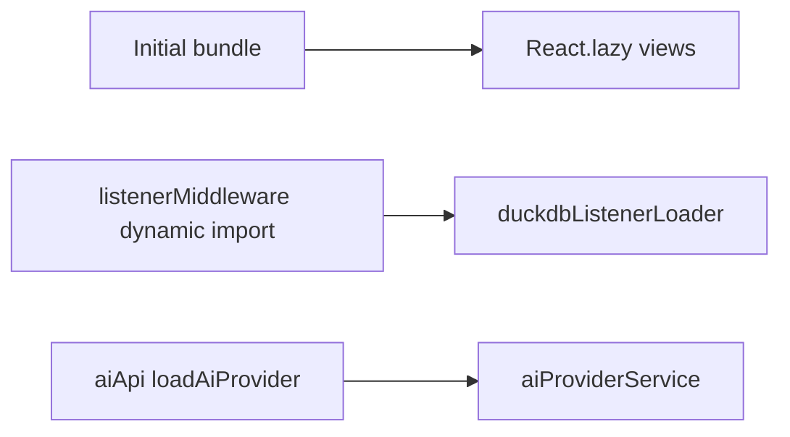

# StoryCraft Studio v1.9 — Sprint Notes

## Goals

- **Cold start:** defer DuckDB/RAG listeners, `aiApi`, Plot Board sub-chunks, ForceGraph, Collaboration.
- **UX:** Plot Board touch/minimap, Dashboard backup card, all 12 feature flags in Settings.
- **Desktop:** Tauri menu, window-state, updater UX, open data folder.
- **Help & Settings:** full Help Center (catalog + search + documentation), Settings guide category.
- **Resilience:** nested `ViewErrorBoundary`, transient AI retry per provider.

## Architecture (lazy loading)



| Area | Implementation |
|------|----------------|
| DuckDB/RAG | `services/duckdb/duckdbListenerLoader.ts`, `app/listenerMiddleware.ts` |
| AI API | `app/aiApi.ts` → `loadAiProvider()` |
| Plot Board | `PlotCanvas`, `SubplotPanel`, `TensionCurvePanel` lazy in `SceneBoardView` |
| Graph | `react-force-graph-2d` lazy in `CharacterGraphView` |
| Shell | `CollaborationPanel` lazy in `App.tsx` |
| Bundles | `vite.config.ts` `manualChunks`, `scripts/check-bundle-budget.mjs` |

## Help Center

- Structure: `services/help/helpCatalog.ts` (source of truth).
- Search: `services/help/helpSearch.ts`, `components/help/HelpSearchPanel.tsx`.
- Categories: Getting Started, Writing, Worldbuilding, AI Studio, Analysis, Management, Settings Guide, **Technical Documentation**, Pro Tips, FAQ.
- AI assistant: `retrieveHelpDocContext()` with 13 offline chunks.
- i18n: `locales/{en,de,es,fr,it}/help.json` + `scripts/help-locales-es-fr-it.json`.

## Settings

- **Guide** (`components/settings/SettingsGuideSection.tsx`) — jump links to all categories.
- **Experimental** (`components/settings/FeatureFlagsSection.tsx`) — all 12 flags.
- **Overview** on General tab; Backup quick actions on Dashboard.
- Desktop: `TauriUpdaterBanner`, open data folder, runtime version in About.

## Tauri desktop

| Feature | Location |
|---------|----------|
| Native menu (File/Help) | `src-tauri/src/lib.rs` → `menu-action` events |
| Menu bridge | `services/tauriMenuService.ts`, `App.tsx` |
| Window state | `tauri-plugin-window-state` |
| Updater UI | `hooks/useTauriUpdater.ts` |
| Runtime helpers | `services/tauriRuntime.ts` |

See [`TAURI-CI.md`](TAURI-CI.md), [`TAURI-UPDATER.md`](TAURI-UPDATER.md).

## Verification

```bash
pnpm run typecheck
pnpm run lint
pnpm run i18n:check
pnpm exec vitest run
pnpm run bundle:budget
pnpm run graphify:update
```
